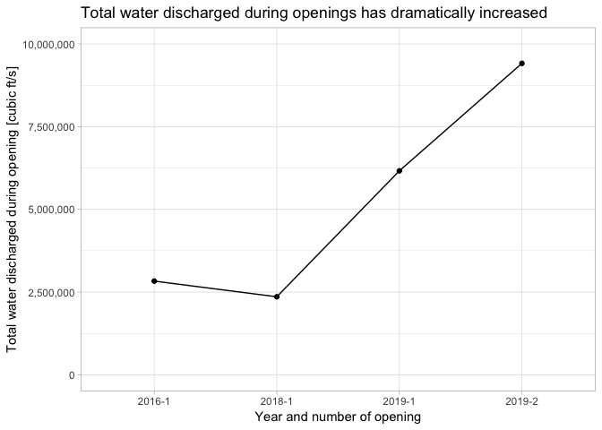
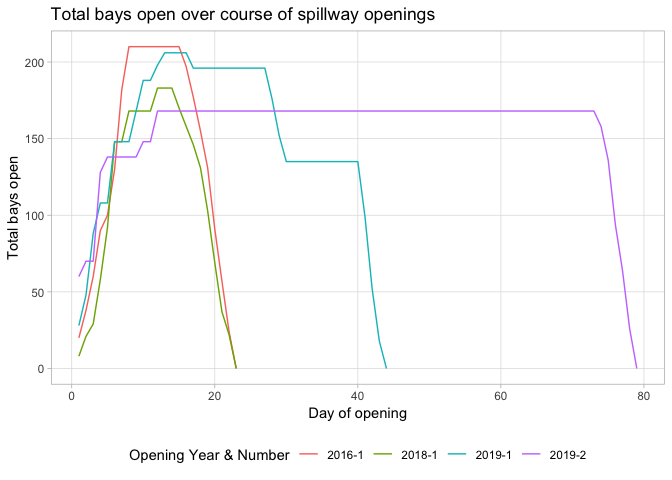

Data-analysis
================

# Libraries and Parameters

``` r
library(tidyverse) #used for easy data manipulation
```

    ## ── Attaching packages ─────────────────────────────────────────────────────────────────────────────────────────────────────── tidyverse 1.2.1 ──

    ## ✔ ggplot2 3.1.1       ✔ purrr   0.3.2  
    ## ✔ tibble  2.1.1       ✔ dplyr   0.8.0.1
    ## ✔ tidyr   0.8.3       ✔ stringr 1.4.0  
    ## ✔ readr   1.3.1       ✔ forcats 0.4.0

    ## ── Conflicts ────────────────────────────────────────────────────────────────────────────────────────────────────────── tidyverse_conflicts() ──
    ## ✖ dplyr::filter() masks stats::filter()
    ## ✖ dplyr::lag()    masks stats::lag()

``` r
library(lubridate) #used for date manipulation
```

    ## 
    ## Attaching package: 'lubridate'

    ## The following object is masked from 'package:base':
    ## 
    ##     date

``` r
#Loading file names from local machine. If you want this code to run on your local machine, you must either: 1. create the exact following file structure under your Home, and clone the git repository to that directory, or 2. change each of these file names when running the program on your local machine.
file_opening1_2019 <- "~/Autumn-2019/COMM177b/rising-waters/2019-Opening1.Rds"
file_opening2_2019 <- "~/Autumn-2019/COMM177b/rising-waters/2019-Opening2.Rds"
file_opening1_2018 <- "~/Autumn-2019/COMM177b/rising-waters/2018-Opening1.Rds"
file_opening1_2016 <- "~/Autumn-2019/COMM177b/rising-waters/2016-Opening1.Rds"
```

# Loading Files

``` r
#Opening files into data tables (called tibbles) for manipulation in the program. We are not editing the raw file at all.
opening1_2019 <- read_rds(file_opening1_2019)
opening2_2019 <- read_rds(file_opening2_2019)
opening1_2018 <- read_rds(file_opening1_2018)
opening1_2016 <- read_rds(file_opening1_2016)
```

# Combining Files

``` r
#combining all data into a single data frame (tibble), and adding a date column
openings <-
  opening1_2019 %>% 
  bind_rows(opening2_2019) %>% 
  bind_rows(opening1_2018) %>% 
  bind_rows(opening1_2016) %>%
  mutate(year = year(date)) #add year column - likely useful in future
```

# Exploratory Analysis

How much water total was released in each opening?

``` r
total_water_discharged <-
  openings %>% 
  group_by(opening_id) %>% 
  summarize(total_water = sum(discharge))
```

``` r
total_water_discharged %>% 
  ggplot(mapping = aes(x = opening_id, y = total_water)) +
  geom_point() +
  geom_line(aes(group = 1)) +
  theme_light() + 
  labs(
    title = "Total water discharged during openings has dramatically increased",
    x = "Year and number of opening",
    y = "Total water discharged during opening [cubic ft/s]"
  ) +
  scale_y_continuous(labels = scales::comma, limits = c(0, 10000000))
```

<!-- -->

``` r
openings %>% 
  ggplot(mapping = aes(x = days_open, y = discharge)) +
  geom_line(aes(color = opening_id)) +
  theme_light() +
  theme(
    panel.grid.minor = element_blank(),
    legend.position = "bottom"
  ) +
  labs(
    title = "Water discharged per day course of spillway openings",
    x = "Day of opening",
    y = "TWater discharged"
  ) +
  guides(color = guide_legend(title = "Opening Year & Number"))
```

<!-- -->

How has the progression of bay release patterns (number of individual
bays opened) changed for successive openings? Hundreds of bays make up
the Bonnet Carre spillway

``` r
openings %>%
  ggplot(mapping = aes(x = days_open, y = total_opened)) +
  geom_line(aes(group = opening_id, color = opening_id)) +
  theme_light() + 
  theme(
    panel.grid.minor = element_blank(),
    legend.position = "bottom"
  ) +
  labs(
    title = "Total bays open over course of spillway openings",
    x = "Day of opening",
    y = "Total bays open"
  ) +
  guides(color = guide_legend(title = "Opening Year & Number")) 
```

<!-- -->
