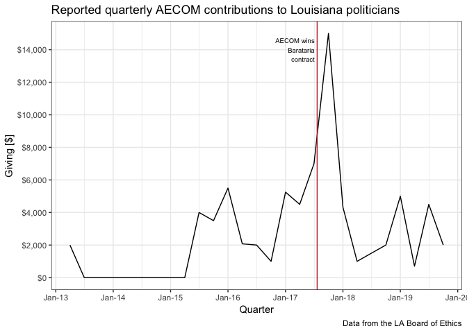
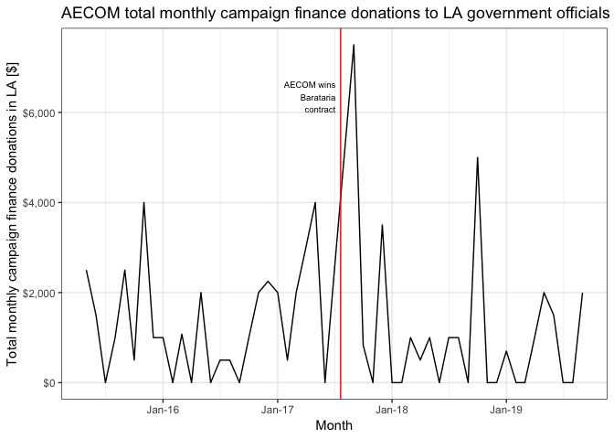
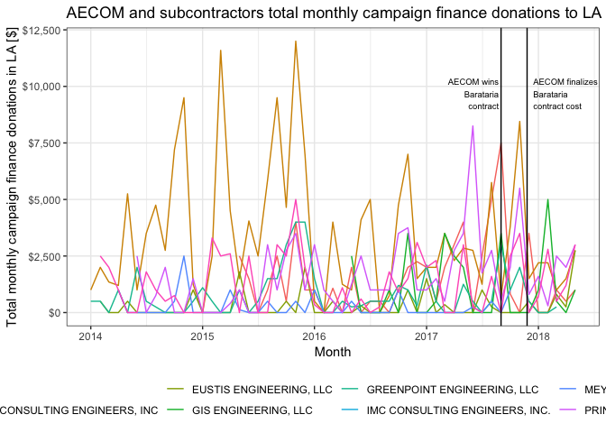
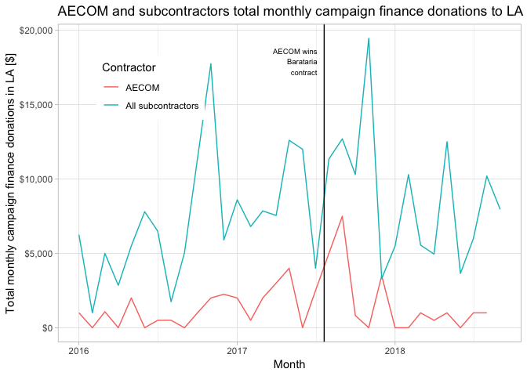
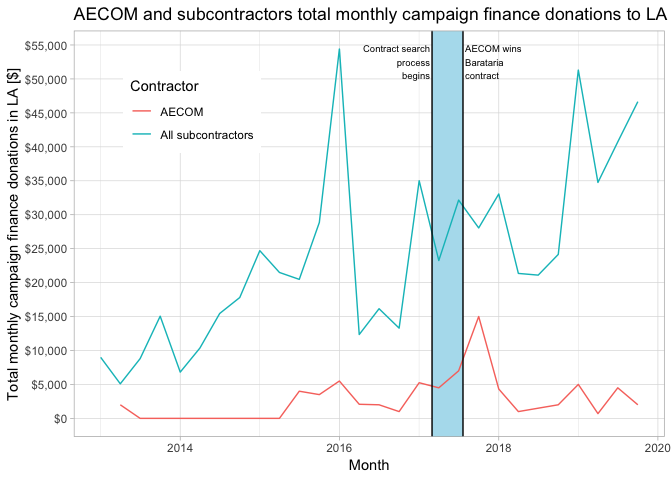
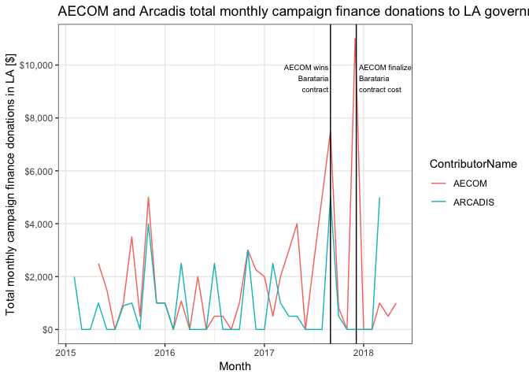

Campaign-finance-analysis
================
Vikas Maturi

# Libraies and Parameters

``` r
#load libraries
library(tidyverse)
```

    ## ── Attaching packages ──────────────────────────────────────────────────────────────────────────────────────────────── tidyverse 1.2.1 ──

    ## ✔ ggplot2 3.1.1       ✔ purrr   0.3.2  
    ## ✔ tibble  2.1.1       ✔ dplyr   0.8.0.1
    ## ✔ tidyr   0.8.3       ✔ stringr 1.4.0  
    ## ✔ readr   1.3.1       ✔ forcats 0.4.0

    ## ── Conflicts ─────────────────────────────────────────────────────────────────────────────────────────────────── tidyverse_conflicts() ──
    ## ✖ dplyr::filter() masks stats::filter()
    ## ✖ dplyr::lag()    masks stats::lag()

``` r
library(lubridate)
```

    ## 
    ## Attaching package: 'lubridate'

    ## The following object is masked from 'package:base':
    ## 
    ##     date

``` r
library(padr)
library(scales)
```

    ## 
    ## Attaching package: 'scales'

    ## The following object is masked from 'package:purrr':
    ## 
    ##     discard

    ## The following object is masked from 'package:readr':
    ## 
    ##     col_factor

CHANGE THIS TO THE LOCATION OF THE SAVED .RDS FILE ON YOUR COMPUTER\!

``` r
#save the file name where the .Rds data is stored - 
LA_contributions_file <- "~/Autumn-2019/COMM177b/LA-contributions.Rds"

lobbying_file <- "~/Autumn-2019/COMM177b/lobbying_data.Rds"

#corrected_AECOM_file <- "~/Autumn-2019/COMM177b/AECOM_contributions_clean.csv"
```

## ONE TIME ONLY; READ IN FILES AND SAVE COMBINED DATA TO RDS

``` r
#save data file names

file_LA_contributions_101012_020913 <- "~/Autumn-2019/COMM177b/LA_contributions_101012_020913.csv"
file_LA_contributions_021013_060913 <- "~/Autumn-2019/COMM177b/LA_contributions_021013_060913.csv"
file_LA_contributions_061013_100913 <- "~/Autumn-2019/COMM177b/LA_contributions_061013_100913.csv"
file_LA_contributions_101013_020914 <- "~/Autumn-2019/COMM177b/LA_contributions_101013_020914.csv"
file_LA_contributions_021014_060914 <- "~/Autumn-2019/COMM177b/LA_contributions_021014_060914.csv"
file_LA_contributions_061014_100914 <- "~/Autumn-2019/COMM177b/LA_contributions_061014_100914.csv"
file_LA_contributions_101014_020915 <- "~/Autumn-2019/COMM177b/LA_contributions_101014_020915.csv"
file_LA_contributions_021015_060915 <- "~/Autumn-2019/COMM177b/LA_contributions_021015_060915.csv"
file_LA_contributions_061015_100915 <- "~/Autumn-2019/COMM177b/LA_contributions_061015_100915.csv"
file_LA_contributions_101015_010916 <- "~/Autumn-2019/COMM177b/LA_contributions_101015_010916.csv"
file_LA_contributions_011016_020916 <- "~/Autumn-2019/COMM177b/LA_contributions_011016_020916.csv"
file_LA_contributions_021016_060916 <- "~/Autumn-2019/COMM177b/LA_contributions_021016_060916.csv"
file_LA_contributions_061016_100916 <- "~/Autumn-2019/COMM177b/LA_contributions_061016_100916.csv"
file_LA_contributions_101016_020917 <- "~/Autumn-2019/COMM177b/LA_contributions_101016_020917.csv"
file_LA_contributions_021017_060917 <- "~/Autumn-2019/COMM177b/LA_contributions_021017_060917.csv"
file_LA_contributions_061017_100917 <- "~/Autumn-2019/COMM177b/LA_contributions_061017_100917.csv"

file_LA_contributions_101017_020918 <- "~/Autumn-2019/COMM177b/LA_contributions_101017_020918.csv"
file_LA_contributions_021018_060918 <- "~/Autumn-2019/COMM177b/LA_contributions_021018_060918.csv"
file_LA_contributions_061018_100918 <- "~/Autumn-2019/COMM177b/LA_contributions_061018_100918.csv"
file_LA_contributions_101018_020919 <- "~/Autumn-2019/COMM177b/LA_contributions_101018_020919.csv"
file_LA_contributions_021019_060919 <- "~/Autumn-2019/COMM177b/LA_contributions_021019_060919.csv"
file_LA_contributions_061019_101019 <- "~/Autumn-2019/COMM177b/LA_contributions_061019-101019.csv"

#save path to save file 
file_save_combined_path <- "~/Autumn-2019/COMM177b/LA-contributions.Rds"
```

``` r
LA_contributions_101012_020913 <- read_csv(file_LA_contributions_101012_020913)
LA_contributions_021013_060913 <- read_csv(file_LA_contributions_021013_060913)
LA_contributions_061013_100913 <- read_csv(file_LA_contributions_061013_100913)
LA_contributions_101013_020914 <- read_csv(file_LA_contributions_101013_020914)
LA_contributions_021014_060914 <- read_csv(file_LA_contributions_021014_060914)
LA_contributions_061014_100914 <- read_csv(file_LA_contributions_061014_100914) 
LA_contributions_101014_020915 <- read_csv(file_LA_contributions_101014_020915) 
LA_contributions_021015_060915 <- read_csv(file_LA_contributions_021015_060915) 
LA_contributions_061015_100915 <- read_csv(file_LA_contributions_061015_100915) 
LA_contributions_101015_020916 <- 
  read_csv(file_LA_contributions_101015_010916) %>% 
  bind_rows(read_csv(file_LA_contributions_011016_020916))
LA_contributions_021016_060916 <- read_csv(file_LA_contributions_021016_060916) 
LA_contributions_061016_100916 <- read_csv(file_LA_contributions_061016_100916) 
LA_contributions_101016_020917 <- read_csv(file_LA_contributions_101016_020917) 
LA_contributions_021017_060917 <- read_csv(file_LA_contributions_021017_060917) 
LA_contributions_061017_100917 <- read_csv(file_LA_contributions_061017_100917)

#read files into tibbles (data frames)
LA_contributions_101017_020918 <- read_csv(file_LA_contributions_101017_020918)
LA_contributions_021018_060918 <- read_csv(file_LA_contributions_021018_060918)
LA_contributions_061018_100918 <- read_csv(file_LA_contributions_061018_100918)
LA_contributions_101018_020919 <- read_csv(file_LA_contributions_101018_020919)
LA_contributions_021019_060919 <- read_csv(file_LA_contributions_021019_060919)
LA_contributions_061019_101019 <- read_csv(file_LA_contributions_061019_101019)
```

``` r
#Join data frames into single tibble (dataframe)
LA_contributions <-
  LA_contributions_061019_101019 %>% 
  bind_rows(LA_contributions_021019_060919) %>% 
  bind_rows(LA_contributions_101018_020919) %>% 
  bind_rows(LA_contributions_061018_100918) %>% 
  bind_rows(LA_contributions_021018_060918) %>% 
  bind_rows(LA_contributions_101017_020918) %>% 
  bind_rows(LA_contributions_061017_100917) %>% 
  bind_rows(LA_contributions_021017_060917) %>% 
  bind_rows(LA_contributions_101016_020917) %>% 
  bind_rows(LA_contributions_061016_100916) %>% 
  bind_rows(LA_contributions_021016_060916) %>% 
  bind_rows(LA_contributions_101015_020916) %>% 
  bind_rows(LA_contributions_061015_100915) %>% 
  bind_rows(LA_contributions_021015_060915) %>% 
  bind_rows(LA_contributions_101014_020915) %>% 
  bind_rows(LA_contributions_061014_100914) %>% 
  bind_rows(LA_contributions_021014_060914) %>% 
  bind_rows(LA_contributions_101013_020914) %>% 
  bind_rows(LA_contributions_061013_100913) %>% 
  bind_rows(LA_contributions_021013_060913) %>% 
  bind_rows(LA_contributions_101012_020913) 
```

``` r
#Write combined data file out output .Rds file
write_rds(LA_contributions, LA_contributions_file)
```

``` r
lobbying_csv_file <- "~/Autumn-2019/COMM177b/CurrentCompanies.csv"

lobbying_csv <- read_csv(lobbying_csv_file)

write_rds(lobbying_csv, "~/Autumn-2019/COMM177b/lobbying_data.Rds")
```

# Loading data

## Read in .Rds data files will all campaign finance data, lobbying data, and AECOM-specific data

``` r
LA_contributions <- 
  read_rds(LA_contributions_file) %>% 
  mutate(ContributionAmt = str_replace(ContributionAmt, "\\$", "")) %>%
  mutate(ContributionAmt = str_replace(ContributionAmt, ",", "")) %>% 
  mutate(ContributionAmt = as.numeric(ContributionAmt)) %>% 
  mutate(ContributionDate = mdy(ContributionDate))
```

    ## Warning: NAs introduced by coercion

``` r
lobbying <- 
  read_rds(lobbying_file) 
```

# Data wrangling: Searching contributor database for contractors

## Filter contributor database by keywords

``` r
contractors_filtered <-
  LA_contributions %>% 
  filter(str_detect(ContributorName, "STANTEC|STANTON CONSTRUCTABILITY|AECOM|GEC INC|GHD INC|LOUISIANA DIVERSION COMPANY|LAFITTE AREA|MOTT MACDONALD|NOLA PAC|NOLA ENGINEERING|WEEKS MARINE|SOIL EROSION SERVICES|PROFESSIONAL CONSTRUCTION SERVICES|SIMON AND DELANEY RESOURCE|COASTAL DREDGING COMPANY|SOIL EROSION|GRILLOT CONSTRUCTION|SEALEVEL CONSTRUCTION|HYDROTERRA TECHNOLOGIES|WILCO MARSH BUGGIES|MITCH'S LANDSCAPING|MITCHS LANDSCAPING|LUHR BRO|BAIRD & ASSOCIATES|JUSTIN REEVES|JUSTIN J REEVES|BERTUCCI CONTRACTING|C&C TECHNOLOGIES|APOLLO ENVIRONMENTAL STRATEGIES|TETRA TECH|HDR ENGINEERING|ROYAL ENGINEERING|ECOLOGICAL RESTORATION SERVICES|GREAT LAKES DREDGE|MAGNOLIA DREDGE|EARTHBALANCE|THE NATURE CONSERVANCY|CRESCENT CITY CONNECTION|MARITIME SERVICES GROUP|LCPA|GASERY AND ASSOCIATES|KEEP LOUISIANA BEAUTIFUL|EXPLUS|TRAILBLAZER RC & D|LEXLEE'S KIDS|NORTH LOUISIANA ECONOMIC|KREBS LASALLE|LOUISIANA PROPERTY ACQUISITION|COASTAL ESTUARY SERVICES|GREGORY C RIGAMER|APTIM ENVIRONMENTAL|CH2M HILL|PBS&J|ROYAL ENGINEER|COASTAL ENGINEERING CONSULTANTS|VAN NESS FELDMAN|COUHIG PARTNERS|DUCKS UNLIMITED|NATIONAL AUDUBON SOCIETY|COALITION TO RESTORE COASTAL|INSTITUTE FOR FAMILY DEVELOPME|PAN AMERICAN ENGINEERS|DAN E CIVELLO|PLAQUEMINE PARISH|LTCI CONSULTING|DMS-DISASTER PLANNING|DISASTER METRICS|DULIN, WARD & DEWALD|NEWCORP|SCI RESEARCH AND CONSULTING|TRUFUND FINANCIAL SERVICES|LOUISIANA HOUSING CORPORATION|ZEHNDER COMMUNICATIONS|EMERGENT METHOD|DISASTER SERVICES CORP|DUPLANTIS DESIGN GROUP|SHULER CONSULTING|APACHE LA MINERALS|SISUNG SECURITIES|BACKFLOW PREVENTION|EMERGENT METHOD|STEPHEN B ORTEGO|ANTHONY ROUSSELL|DALE W WYBLE|CHARLES K. MONTGOMERY|SPENCER J OWENS|IMPROVED ANALYSIS THROUGH MODELING|COASTAL CONSERVATION")) %>% 
  arrange(desc(ContributorName)) %>% 
  select(ContributorName, everything()) 
```

## Correct contractor names for misspellings, giving under similar but distinct names (e.g., AECOM LLC vs. AECOM) and remove duplicate entries

``` r
contractor_contributors <-
  contractors_filtered %>%
  mutate(ContributorName = if_else(str_detect(ContributorName, "ROYAL ENGINEER"), "ROYAL ENGINEERS & CONSULTANTS", ContributorName)) %>% 
  mutate(ContributorName = if_else(str_detect(ContributorName, "AECOM"), "AECOM", ContributorName)) %>% 
  mutate(ContributorName = if_else(str_detect(ContributorName, "COUHIG"), "COUHIG", ContributorName)) %>% 
  mutate(ContributorName = if_else(str_detect(ContributorName, "MOTT MACDONALD"), "MOTT MACDONALD", ContributorName)) %>% 
  mutate(ContributorName = if_else(str_detect(ContributorName, "DUPLANTIS"), "DUPLANTIS", ContributorName)) %>%
  mutate(ContributorName = if_else(str_detect(ContributorName, "CH2M"), "CH2M", ContributorName)) %>% 
  mutate(ContributorName = if_else(str_detect(ContributorName, "WILCO MARSH"), "WILCO MARSH", ContributorName)) %>% 
  mutate(ContributorName = if_else(str_detect(ContributorName, "BERTUCCI"), "BERTUCCI CONSULTING", ContributorName)) %>% 
  mutate(ContributorName = if_else(str_detect(ContributorName, "PAN AMERICAN"), "PAN AMERICAN ENGINEERS, LLC", ContributorName)) %>% 
  mutate(ContributorName = if_else(str_detect(ContributorName, "SEALEVEL"), "SEALEVEL CONSTRUCTION INC", ContributorName)) %>%
  mutate(ContributorName = if_else(str_detect(ContributorName, "SOIL EROSION SERVICES"), "SOIL EROSION SERVICES, LLC", ContributorName)) %>%
  mutate(ContributorName = if_else(str_detect(ContributorName, "EMERGENT METHOD"), "EMERGENT METHOD LLC", ContributorName)) %>%
  mutate(ContributorName = if_else(str_detect(ContributorName, "MAGNOLIA DREDGE & DOCK"), "MAGNOLIA DREDGE & DOCK, LLC", ContributorName)) %>%
  mutate(ContributorName = if_else(str_detect(ContributorName, "STANTEC CONSULTING SERVICES"), "STANTEC CONSULTING SERVICES, INC", ContributorName)) %>%
  mutate(ContributorName = if_else(str_detect(ContributorName, "ZEHNDER COMMUNICATIONS"), "ZEHNDER COMMUNICATIONS, LLC", ContributorName)) %>% 
  select(ContributorName, FilerFirstName, FilerLastName, ContributionDate, ContributionAmt, ContributorCity, ContributorState) %>% 
  #removes duplicate rows in dataframe
  distinct()
```

## Total giving by each contractor

``` r
total_giving_contractor <-
  contractor_contributors %>% 
  group_by(ContributorName) %>% 
  summarize(total_giving = sum(ContributionAmt, na.rm = TRUE)) %>% 
  arrange(desc(total_giving))

total_giving_contractor %>% head(10) %>% knitr::kable()
```

| ContributorName               | total\_giving |
| :---------------------------- | ------------: |
| ROYAL ENGINEERS & CONSULTANTS |     128950.00 |
| AECOM                         |      72850.00 |
| CH2M                          |      71242.14 |
| PAN AMERICAN ENGINEERS, LLC   |      64850.00 |
| DUPLANTIS                     |      54832.97 |
| COUHIG                        |      26200.00 |
| MOTT MACDONALD                |      24850.00 |
| NOLA PAC                      |      24500.00 |
| WILCO MARSH                   |      22430.00 |
| BERTUCCI CONSULTING           |      10100.00 |

``` r
#Write total_giving_contractor to CSV
write_csv(total_giving_contractor, "~/Autumn-2019/COMM177b/total_contractor_giving.csv")
```

This analysis reveals two important additional companies to review: CH2M
and ROYAL ENGINEERS & CONSULTANTS. These consulting groupss have given
massive amounts of money to a number of candidates. Further
investigation is warranted.

## Dataset just AECOM giving

``` r
AECOM <-
  contractor_contributors %>% 
  filter(str_detect(ContributorName, "AECOM")) 
```

# Data Wrangling: Lobbying

## Filter lobbying data for relevant contractors

``` r
lobbyists_filtered <-
  lobbying %>% 
  filter(str_detect(Rep_Name, "STANTEC|STANTON CONSTRUCTABILITY|AECOM|GEC INC|GHD INC|LOUISIANA DIVERSION COMPANY|LAFITTE AREA|MOTT MACDONALD|NOLA PAC|NOLA ENGINEERING|WEEKS MARINE|SOIL EROSION SERVICES|PROFESSIONAL CONSTRUCTION SERVICES|SIMON AND DELANEY RESOURCE|COASTAL DREDGING COMPANY|SOIL EROSION|GRILLOT CONSTRUCTION|SEALEVEL CONSTRUCTION|HYDROTERRA TECHNOLOGIES|WILCO MARSH BUGGIES|MITCH'S LANDSCAPING|MITCHS LANDSCAPING|LUHR BRO|BAIRD & ASSOCIATES|JUSTIN REEVES|JUSTIN J REEVES|BERTUCCI CONTRACTING|C&C TECHNOLOGIES|APOLLO ENVIRONMENTAL STRATEGIES|TETRA TECH|HDR ENGINEERING|ROYAL ENGINEERING|ECOLOGICAL RESTORATION SERVICES|GREAT LAKES DREDGE|MAGNOLIA DREDGE|EARTHBALANCE|THE NATURE CONSERVANCY|CRESCENT CITY CONNECTION|MARITIME SERVICES GROUP|LCPA|GASERY AND ASSOCIATES|KEEP LOUISIANA BEAUTIFUL|EXPLUS|TRAILBLAZER RC & D|LEXLEE'S KIDS|NORTH LOUISIANA ECONOMIC|KREBS LASALLE|LOUISIANA PROPERTY ACQUISITION|COASTAL ESTUARY SERVICES|GREGORY C RIGAMER|APTIM ENVIRONMENTAL|CH2M HILL|PBS&J|ROYAL ENGINEER|COASTAL ENGINEERING CONSULTANTS|VAN NESS FELDMAN|COUHIG PARTNERS|DUCKS UNLIMITED|NATIONAL AUDUBON SOCIETY|COALITION TO RESTORE COASTAL|INSTITUTE FOR FAMILY DEVELOPME|PAN AMERICAN ENGINEERS|DAN E CIVELLO|PLAQUEMINE PARISH|LTCI CONSULTING|DMS-DISASTER PLANNING|DISASTER METRICS|DULIN, WARD & DEWALD|NEWCORP|SCI RESEARCH AND CONSULTING|TRUFUND FINANCIAL SERVICES|LOUISIANA HOUSING CORPORATION|ZEHNDER COMMUNICATIONS|EMERGENT METHOD|DISASTER SERVICES CORP|DUPLANTIS DESIGN GROUP|SHULER CONSULTING|APACHE LA MINERALS|SISUNG SECURITIES|BACKFLOW PREVENTION|EMERGENT METHOD|STEPHEN B ORTEGO|ANTHONY ROUSSELL|DALE W WYBLE|CHARLES K. MONTGOMERY|SPENCER J OWENS|IMPROVED ANALYSIS THROUGH MODELING|COASTAL CONSERVATION|PARSONS BRINKERHOFF|EUSTIS ENGINEER|BAKER SMITH|FTN ASSOCIATES|ALL SOUTH CONSULTING ENGINEER|GIS ENGINEER|GREENPOINT ENGINEER|IMC CONSULTING ENGINEER|MEYERS ENGINEERS|PRINCIPAL ENGINEERING|ALDEN RESEARCH LABORATORY|DOWNEY ENGINEERING CORP|ECOSERVICE PARTNERS|ROYAL HASKONING")) %>% 
  arrange(desc(Rep_Name)) %>% 
  select(Rep_Name, everything()) 
```

## Correct contractor names in lobbying dataset for misspellings, giving under similar but distinct names (e.g., AECOM LLC vs. AECOM)

``` r
contractor_lobbyists <-
  lobbyists_filtered %>%
  mutate(Rep_Name = if_else(str_detect(Rep_Name, "ROYAL ENGINEER"), "ROYAL ENGINEERS & CONSULTANTS", Rep_Name)) %>% 
  mutate(Rep_Name = if_else(str_detect(Rep_Name, "AECOM"), "AECOM", Rep_Name)) %>% 
  mutate(Rep_Name = if_else(str_detect(Rep_Name, "COUHIG"), "COUHIG", Rep_Name)) %>% 
  mutate(Rep_Name = if_else(str_detect(Rep_Name, "MOTT MACDONALD"), "MOTT MACDONALD", Rep_Name)) %>% 
  mutate(Rep_Name = if_else(str_detect(Rep_Name, "DUPLANTIS"), "DUPLANTIS", Rep_Name)) %>%
  mutate(Rep_Name = if_else(str_detect(Rep_Name, "CH2M"), "CH2M", Rep_Name)) %>% 
  mutate(Rep_Name = if_else(str_detect(Rep_Name, "WILCO MARSH"), "WILCO MARSH", Rep_Name)) %>% 
  mutate(Rep_Name = if_else(str_detect(Rep_Name, "BERTUCCI"), "BERTUCCI CONSULTING", Rep_Name)) %>% 
  mutate(Rep_Name = if_else(str_detect(Rep_Name, "PAN AMERICAN"), "PAN AMERICAN ENGINEERS, LLC", Rep_Name)) %>% 
  mutate(Rep_Name = if_else(str_detect(Rep_Name, "SEALEVEL"), "SEALEVEL CONSTRUCTION INC", Rep_Name)) %>%
  mutate(Rep_Name = if_else(str_detect(Rep_Name, "SOIL EROSION SERVICES"), "SOIL EROSION SERVICES, LLC", Rep_Name)) %>%
  mutate(Rep_Name = if_else(str_detect(Rep_Name, "EMERGENT METHOD"), "EMERGENT METHOD LLC", Rep_Name)) %>%
  mutate(Rep_Name = if_else(str_detect(Rep_Name, "MAGNOLIA DREDGE & DOCK"), "MAGNOLIA DREDGE & DOCK, LLC", Rep_Name)) %>%
  mutate(Rep_Name = if_else(str_detect(Rep_Name, "STANTEC CONSULTING SERVICES"), "STANTEC CONSULTING SERVICES, INC", Rep_Name)) %>%
  mutate(Rep_Name = if_else(str_detect(Rep_Name, "ZEHNDER COMMUNICATIONS"), "ZEHNDER COMMUNICATIONS, LLC", Rep_Name)) %>% 
  mutate(Rep_Name = if_else(str_detect(Rep_Name, "STANTEC CONSULTING SERVICES"), "STANTEC CONSULTING SERVICES, INC", Rep_Name)) %>%
  mutate(Rep_Name = if_else(str_detect(Rep_Name, "BAKER SMITH"), "T. BAKER SMITH", Rep_Name)) %>% 
  mutate(Rep_Name = if_else(str_detect(Rep_Name, "ALL SOUTH CONSULTING ENGINEER"), "ALL SOUTH CONSULTING ENGINEERS, INC", Rep_Name)) %>%
  mutate(Rep_Name = if_else(str_detect(Rep_Name, "PRINCIPAL ENGINEERING"), "PRINCIPAL ENGINEERING, INC.", Rep_Name)) %>%
  mutate(Rep_Name = if_else(str_detect(Rep_Name, "GIS ENGINEERING"), "GIS ENGINEERING, LLC", Rep_Name)) %>%
  mutate(Rep_Name = if_else(str_detect(Rep_Name, "EUSTIS ENGINEERING"), "EUSTIS ENGINEERING, LLC", Rep_Name)) %>%
  mutate(Rep_Name = if_else(str_detect(Rep_Name, "GREENPOINT ENGINEERING"), "GREENPOINT ENGINEERING, LLC", Rep_Name)) %>%
  mutate(Rep_Name = if_else(str_detect(Rep_Name, "MEYERS ENGINEERS"), "MEYERS ENGINEERS, LTD", Rep_Name))
```

## Number of lobbyists per contractor

``` r
lobbyists_per_contractor <-
  contractor_lobbyists %>% 
  count(Rep_Name) %>% 
  arrange(desc(n))

lobbyists_per_contractor %>% knitr::kable()
```

| Rep\_Name                                |                                                                                           n |
| :--------------------------------------- | ------------------------------------------------------------------------------------------: |
| AECOM                                    |                                                                                           6 |
| CH2M                                     |                                                                                           3 |
| DUPLANTIS                                |                                                                                           3 |
| NORTH LOUISIANA ECONOMIC PARTNERSHIP     |                                                                                           3 |
| COUHIG                                   |                                                                                           2 |
| GREAT LAKES DREDGE & DOCK CORPORATION    |                                                                                           2 |
| This analysis is less interesting; thoug | h a few groups have contractors, AECOM has more lobbyists than any other listed contractor. |

# Analysis: Which candidates are receiving the most money from contractors?

## Which candidates are receiving the most money from ANY contractor?

``` r
candidate_total_received <-
  contractor_contributors %>% 
  group_by(FilerLastName, FilerFirstName) %>% 
  summarize(total_received = sum(ContributionAmt)) %>% 
  arrange(desc(total_received))

candidate_total_received %>% head(15) %>% knitr::kable()
```

| FilerLastName                                                                  | FilerFirstName  | total\_received |
| :----------------------------------------------------------------------------- | :-------------- | --------------: |
| Edwards                                                                        | John Bel        |        44600.00 |
| Landry                                                                         | Jeff            |        26000.00 |
| Vitter                                                                         | David           |        25000.00 |
| Nungesser                                                                      | William (Billy) |        16650.00 |
| Cantrell                                                                       | LaToya          |        16500.00 |
| LA Democrats (formerly Democratic PAC of the Demo. St. Central Comm., DEMOPAC) | NA              |        16500.00 |
| John Bel Edwards for Louisiana Leadership PAC, LLC                             | NA              |        12500.00 |
| Weston Broome                                                                  | Sharon          |        12000.00 |
| Charbonnet                                                                     | Desiree         |        11500.00 |
| McInnis                                                                        | Guy             |        10000.00 |
| Move EBR, Inc.                                                                 | NA              |        10000.00 |
| NOLA PAC                                                                       | NA              |        10000.00 |
| Holden                                                                         | Melvin L. (Kip) |         9992.14 |
| Landrieu                                                                       | Mitch           |         9500.00 |
| Johnston                                                                       | Paul            |         7600.00 |

``` r
#write_csv(candidate_total_received, "~/Autumn-2019/COMM177b/candidates_total_received.csv")
```

This reveals a select number of candidates receiving massive amounts of
money from contractors. This poses an important next question; do these
candidates have real decision-making power regarading (or influence
over) contract
approval?

## Which candidates are receiving the most money from contractors giving \> 10,000 since 2012?

``` r
contractors_10000plus <-
  total_giving_contractor %>% 
  filter(total_giving > 10000) %>% 
  select(ContributorName) 

candidate_amt_received_bigmoney_contractors <-
  contractor_contributors %>% 
  inner_join(contractors_10000plus, by = "ContributorName") %>% 
  group_by(FilerLastName, FilerFirstName) %>% 
  summarize(total_received = sum(ContributionAmt)) %>% 
  arrange(desc(total_received))

#write_csv(candidate_amt_received_bigmoney_contractors, "~/Autumn-2019/COMM177b/candidates_amt_received_bigmoney_contractors.csv")
```

Most of the top candidates money is coming from the largest
contributors. This is somewhat logical, but indicates that it a small
number of contracting companies that have outsized influence over
lawmaker
decisions.

## Analysis: Which candidataes are receiving the most money from SPILLWAY developers?

``` r
diversion_contractors <- 
  tribble(~ContributorName, "AECOM", "STANTEC CONSULTING SERVICES", "KREBS LASALLE ENVIRONMENTAL, LLC")

candidate_amt_received_spillway_contractors <-
  contractor_contributors %>% 
  inner_join(diversion_contractors, by = "ContributorName") %>% 
  group_by(FilerLastName, FilerFirstName) %>% 
  summarize(total_received = sum(ContributionAmt)) %>% 
  arrange(desc(total_received))

candidate_amt_received_spillway_contractors %>% head(10) %>%  knitr::kable()
```

| FilerLastName                                      | FilerFirstName  | total\_received |
| :------------------------------------------------- | :-------------- | --------------: |
| John Bel Edwards for Louisiana Leadership PAC, LLC | NA              |           10000 |
| Cantrell                                           | LaToya          |            5000 |
| Edwards                                            | John Bel        |            5000 |
| Johnston                                           | Paul            |            5000 |
| Cochran                                            | Larry           |            3500 |
| Smith, Jr.                                         | Gary L.         |            3025 |
| Lee-Sheng                                          | Cynthia         |            3000 |
| Nungesser                                          | William (Billy) |            3000 |
| Move EBR, Inc.                                     | NA              |            2500 |
| Spears                                             | Mark            |            2500 |

``` r
#write_csv(candidate_amt_received_spillway_contractors, "~/Autumn-2019/COMM177b/candidates_amt_received_spillway_contractors.csv")
```

When looking specifically at spillway developers, we see their donations
are across a broad swath of candidates, with a few candidates receiving
a large amount of money.

Further investigation reveals that it is largely AECOM giving this
money; we explore this
below.

# Analysis: Investigations into SPILLWAY CONTRACTORS (AECOM and STANTEC) giving extremely large amounts

## AECOM CORPORATE giving to each candidate

``` r
AECOM_candidates <-
  AECOM  %>% 
  arrange(FilerLastName) %>% 
  mutate(available_cont = if_else(is.na(ContributionAmt), 0, ContributionAmt)) %>% 
  group_by(FilerLastName, FilerFirstName) %>% 
  summarize(total_reported = sum(available_cont)) %>% 
  arrange(desc(total_reported))

AECOM_candidates %>% head(10) %>% knitr::kable()
```

| FilerLastName                                      | FilerFirstName  | total\_reported |
| :------------------------------------------------- | :-------------- | --------------: |
| John Bel Edwards for Louisiana Leadership PAC, LLC | NA              |           10000 |
| Cantrell                                           | LaToya          |            5000 |
| Edwards                                            | John Bel        |            5000 |
| Johnston                                           | Paul            |            5000 |
| Cochran                                            | Larry           |            3500 |
| Smith, Jr.                                         | Gary L.         |            3025 |
| Lee-Sheng                                          | Cynthia         |            3000 |
| Nungesser                                          | William (Billy) |            3000 |
| Move EBR, Inc.                                     | NA              |            2500 |
| Spears                                             | Mark            |            2500 |

``` r
#write_csv(AECOM_candidates, "~/Autumn-2019/COMM177b/AECOM_candidate_reported_giving.csv")
```

AECOM focused their giving on the Mayor of New Orleans, LaToya Cantrell
(12,500), and the the governor, John Bel Edwards (15,000 between the PAC
and the candidate directly). Further investigation is required into the
role that these two offices play in the solicitation and selection of
contractors for large environmental projects.

## AECOM CORPORATE total giving

``` r
AECOM_total_giving <-
  AECOM %>% 
  filter(ContributionDate > "2015-01-01") %>% 
  summarize(total_AECOM = sum(ContributionAmt, na.rm = TRUE))

AECOM_total_giving
```

    ## # A tibble: 1 x 1
    ##   total_AECOM
    ##         <dbl>
    ## 1       70850

## AECOM CORPORATE giving per year

``` r
AECOM_yearly_giving <-
  AECOM %>% 
  mutate(year = year(ContributionDate)) %>% 
  filter(ContributionDate > "2011-01-01") %>% 
  mutate(halfyear = ceiling_date(ContributionDate, "quarter")) %>% 
  group_by(halfyear) %>% 
  summarize(halfyearly_giving = sum(ContributionAmt)) %>% 
  pad() %>% 
  mutate(halfyearly_giving = if_else(is.na(halfyearly_giving), 0, halfyearly_giving))
```

    ## pad applied on the interval: quarter

``` r
AECOM_giving_around_contract <-
  AECOM %>% 
  filter(ContributionDate > "2017-02-21", ContributionDate < "2017-12-21")

AECOM_giving_around_contract %>% 
  summarize(sum = sum(ContributionAmt))
```

    ## # A tibble: 1 x 1
    ##     sum
    ##   <dbl>
    ## 1 28825

``` r
AECOM_yearly_giving_plot <-
  AECOM_yearly_giving %>% 
  ggplot(mapping = aes(x = halfyear, y = halfyearly_giving)) +
  geom_line() + 
  theme_bw() +
  scale_x_date(
    date_breaks = "1 year",
    date_labels = "%b-%y"
    #limits = c(2004, 2008, 2012, 2014, 2015, 2016, 2017, 2018, 2019)
  ) +
  scale_y_continuous(
    breaks = seq(0, 16000, 2000),
    minor_breaks = NULL,
    labels = scales::dollar
  ) +
  geom_vline(xintercept = as_date("2017-07-21"), color = "red") +
  annotate("text", x = as_date("2017-07-05"), y = 14000, label = "AECOM wins\nBarataria\ncontract", size = 2.5, hjust = 1) +
  labs(
    y = "Giving [$]",
    x = "Quarter",
    title = "Reported quarterly AECOM contributions to Louisiana politicians",
    caption = "Data from the LA Board of Ethics"
  ) 

AECOM_yearly_giving_plot
```

<!-- -->

``` r
ggsave("AECOM_yearly_giving_plot.pdf", width = 7, height = 5, plot = AECOM_yearly_giving_plot)
```

## AECOM CORPORATE monthly giving before securing the Barataria contract

``` r
AECOM_monthly_giving_plot <-
  AECOM %>%
  mutate(date_month = floor_date(ContributionDate, unit = "month")) %>% 
  filter(ContributionDate > "2015-01-01", ContributionDate < "2019-10-01") %>% 
  group_by(date_month) %>% 
  summarize(monthly_giving = sum(ContributionAmt)) %>% 
  pad() %>%   # this line aadds the missing days
  mutate(monthly_giving = if_else(is.na(monthly_giving), 0, monthly_giving)) %>% 
  ggplot(mapping = aes(x = date_month, y = monthly_giving)) +
  geom_line() + 
  theme_bw() +
  annotate("text", x = as_date("2017-07-05"), y = 6000, label = "AECOM wins\nBarataria\ncontract", size = 2.5, hjust = 1, vjust = 0) +    geom_vline(aes(xintercept = as_date("2017-07-21")), color = "red") +
  scale_x_date(
    date_breaks = "1 year",
    date_labels = "%b-%y"
    #limits = c(2004, 2008, 2012, 2014, 2015, 2016, 2017, 2018, 2019)
  ) +
  scale_y_continuous(
    breaks = seq(0, 8000, 2000),
    minor_breaks = NULL,
    labels = scales::dollar
  ) +
  labs(
    title = "AECOM total monthly campaign finance donations to LA government officials",
    y = "Total monthly campaign finance donations in LA [$]",
    x = "Month"
  )
```

    ## pad applied on the interval: month

``` r
AECOM_monthly_giving_plot
```

<!-- -->

``` r
ggsave("AECOM_monthly_giving_plot.pdf", width = 7, height = 5, plot = AECOM_monthly_giving_plot)
```

## AECOM giving 9 months before

``` r
AECOM %>% 
  filter(ContributionDate > "2016-10-21") %>% 
  filter(ContributionDate < "2017-10-21") %>% 
  summarize(sum = sum(ContributionAmt))
```

    ## # A tibble: 1 x 1
    ##     sum
    ##   <dbl>
    ## 1 30750

## AECOM FAMILY + CORPORATE giving to each candidate

We include in our search campaign finance donations by both AECOM or any
person closely affiliated with a leader at
AECOM

``` r
# We include in  our search campaign  finance donations by both AECOM or any person closely affiliated with a leader at AECOM
AECOM_family_candidates <-
  LA_contributions  %>%
  filter(str_detect(ContributorName, "AECOM|MICHAEL BURKE|JOAN BURKE|ALEXANDRA BURKE|OLIVIA BURKE|THERESE BURKE|CARLA CHRISTOFFERSON|ADAM CHRISTOFFERSON|STEVE MORRISS|LARA POLONI|HEATHER RIM|GLENN ROBSON|W. TROY RUDD|JOHN VOLLMER|FREDERICK WERNER|RANDALL WOTRING")) %>% 
  arrange(desc(ContributorName)) %>% 
  select(ContributorName, everything()) %>% 
  arrange(FilerLastName) %>% 
  mutate(available_cont = if_else(is.na(ContributionAmt), 0, ContributionAmt)) %>% 
  group_by(FilerLastName, FilerFirstName) %>% 
  summarize(total_reported = sum(available_cont)) %>% 
  arrange(desc(total_reported))

AECOM_family_candidates %>% head(10) %>% knitr::kable()
```

| FilerLastName                                      | FilerFirstName  | total\_reported |
| :------------------------------------------------- | :-------------- | --------------: |
| Cantrell                                           | LaToya          |           12500 |
| John Bel Edwards for Louisiana Leadership PAC, LLC | NA              |           10000 |
| Edwards                                            | John Bel        |            5025 |
| Johnston                                           | Paul            |            5000 |
| Cochran                                            | Larry           |            3500 |
| Zahn                                               | Ben             |            3500 |
| Smith, Jr.                                         | Gary L.         |            3025 |
| Lee-Sheng                                          | Cynthia         |            3000 |
| Nungesser                                          | William (Billy) |            3000 |
| Roberts                                            | Christopher     |            3000 |

``` r
#write_csv(AECOM_candidates, "~/Autumn-2019/COMM177b/AECOM_candidate_reported_giving.csv")
```

AECOM execs and their family members do not appear to have made campaign
finance contributions in LA politics.

## STANTEC giving to each candidate

``` r
Stantec_candidates <-
  contractor_contributors %>% 
  filter(str_detect(ContributorName, "STANTEC")) %>% 
  group_by(FilerLastName, FilerFirstName) %>% 
  summarize(total_reported = sum(ContributionAmt)) %>% 
  arrange(desc(total_reported))

Stantec_candidates %>% knitr::kable()
```

| FilerLastName  | FilerFirstName | total\_reported |
| :------------- | :------------- | --------------: |
| Move EBR, Inc. | NA             |            5000 |
| Berthelot, Jr. | Riley L.       |             100 |

``` r
#write_csv(AECOM_candidates, "~/Autumn-2019/COMM177b/AECOM_candidate_reported_giving.csv")
```

STANTEC appears to be giving largely to Move EBR PAC. Further
investigation revealed that MovEBR is a major infrastructure tax package
supported by many local engineering, construction, and consulting firms,
given that it was likely to spur increased business.

## STANTEC total giving

``` r
STANTEC_total_giving <-
  contractor_contributors %>% 
  filter(str_detect(ContributorName, "STANTEC")) %>% 
  summarize(total_stantec = sum(ContributionAmt, na.rm = TRUE))
```

# Analysis of AECOM subcontractors

## What are the giving patterns of the subcontractors hired by AECOM for the project?

If AECOM subcontractors are giving a lot, it may suggest that AECOM
pushed them to give to further secure their potential of obtaining the
contract

``` r
subcontractor_contributions <-
  LA_contributions  %>%
  filter(str_detect(ContributorName, "AECOM|PARSONS BRINKERHOFF|EUSTIS ENGINEER|BAKER SMITH|FTN ASSOCIATES|ALL SOUTH CONSULTING ENGINEER|GIS ENGINEER|GREENPOINT ENGINEER|IMC CONSULTING ENGINEER|MEYERS ENGINEERS|PRINCIPAL ENGINEERING|ALDEN RESEARCH LABORATORY|DOWNEY ENGINEERING CORP|ECOSERVICE PARTNERS|ROYAL HASKONING")) %>% 
  mutate(ContributorName = if_else(str_detect(ContributorName, "AECOM"), "AECOM", ContributorName)) %>% 
  mutate(ContributorName = if_else(str_detect(ContributorName, "STANTEC CONSULTING SERVICES"), "STANTEC CONSULTING SERVICES, INC", ContributorName)) %>%
  mutate(ContributorName = if_else(str_detect(ContributorName, "BAKER SMITH"), "T. BAKER SMITH", ContributorName)) %>% 
mutate(ContributorName = if_else(str_detect(ContributorName, "ALL SOUTH CONSULTING ENGINEER"), "ALL SOUTH CONSULTING ENGINEERS, INC", ContributorName)) %>%
  mutate(ContributorName = if_else(str_detect(ContributorName, "PRINCIPAL ENGINEERING"), "PRINCIPAL ENGINEERING, INC.", ContributorName)) %>%
  mutate(ContributorName = if_else(str_detect(ContributorName, "GIS ENGINEERING"), "GIS ENGINEERING, LLC", ContributorName)) %>%
  mutate(ContributorName = if_else(str_detect(ContributorName, "EUSTIS ENGINEERING"), "EUSTIS ENGINEERING, LLC", ContributorName)) %>%
  mutate(ContributorName = if_else(str_detect(ContributorName, "GREENPOINT ENGINEERING"), "GREENPOINT ENGINEERING, LLC", ContributorName)) %>%
  mutate(ContributorName = if_else(str_detect(ContributorName, "MEYERS ENGINEERS"), "MEYERS ENGINEERS, LTD", ContributorName)) %>%
  arrange(desc(ContributorName)) %>% 
  select(ContributorName, FilerFirstName, FilerLastName, ContributionDate, ContributionAmt, ContributorCity, ContributorState) %>% 
  #removes duplicate rows in dataframe
  distinct()
```

## Total giving by subcontractor since 2012

``` r
total_giving_subcontractor <-
  subcontractor_contributions %>% 
  filter(ContributionDate > "2014-10-10") %>% 
  filter(!str_detect(ContributorName, "AECOM")) %>% 
  group_by(ContributorName) %>% 
  summarize(total_giving = sum(ContributionAmt, na.rm = TRUE)) %>% 
  arrange(desc(total_giving))

total_giving_subcontractor %>% head(10) %>% knitr::kable()
```

| ContributorName                     | total\_giving |
| :---------------------------------- | ------------: |
| ALL SOUTH CONSULTING ENGINEERS, INC |      213157.2 |
| PRINCIPAL ENGINEERING, INC.         |      117850.0 |
| T. BAKER SMITH                      |      104700.0 |
| GIS ENGINEERING, LLC                |       62500.0 |
| GREENPOINT ENGINEERING, LLC         |       40750.0 |
| EUSTIS ENGINEERING, LLC             |       21500.0 |
| MEYERS ENGINEERS, LTD               |       14075.0 |
| IMC CONSULTING ENGINEERS, INC.      |        5000.0 |

``` r
total_subs <- total_giving_subcontractor %>% summarize(tot = sum(total_giving))
```

## Total giving by subcontractor through approval process (since late 2016)

``` r
subcontractor_giving_since_2016 <-
  subcontractor_contributions %>% 
  filter(!str_detect(ContributorName, "AECOM")) %>% 
  filter(ContributionDate > "2015-12-31") %>% 
  group_by(ContributorName) %>% 
  summarize(total_giving = sum(ContributionAmt, na.rm = TRUE)) %>% 
  arrange(desc(total_giving))

subcontractor_giving_since_2016 %>% head(10) %>% knitr::kable()
```

| ContributorName                     | total\_giving |
| :---------------------------------- | ------------: |
| ALL SOUTH CONSULTING ENGINEERS, INC |        132765 |
| PRINCIPAL ENGINEERING, INC.         |        103700 |
| T. BAKER SMITH                      |         80550 |
| GIS ENGINEERING, LLC                |         62500 |
| GREENPOINT ENGINEERING, LLC         |         23150 |
| EUSTIS ENGINEERING, LLC             |         16200 |
| MEYERS ENGINEERS, LTD               |          9450 |
| IMC CONSULTING ENGINEERS, INC.      |          5000 |

## Candidates receiving the most from AECOM subcontractors

``` r
candidate_total_subcontractors <-
  subcontractor_contributions %>%
  filter(!str_detect(ContributorName, "AECOM")) %>% 
  group_by(FilerLastName, FilerFirstName) %>% 
  summarize(total_received = sum(ContributionAmt)) %>% 
  arrange(desc(total_received))

candidate_total_subcontractors %>% head(15) %>% knitr::kable()
```

| FilerLastName                                     | FilerFirstName  | total\_received |
| :------------------------------------------------ | :-------------- | --------------: |
| Zahn                                              | Ben             |           26700 |
| Yenni                                             | Michael S.      |           22250 |
| Cochran                                           | Larry           |           21500 |
| Templet                                           | Ricky           |           21500 |
| Spears                                            | Mark            |           20500 |
| Nungesser                                         | William (Billy) |           20225 |
| Edwards                                           | John Bel        |           20000 |
| Charbonnet                                        | Desiree         |           18500 |
| Cantrell                                          | LaToya          |           17500 |
| Van Vrancken                                      | Jennifer        |           17500 |
| Impastato                                         | Dominick        |           15350 |
| Johnston                                          | Paul            |           14500 |
| McInnis                                           | Guy             |           14000 |
| LA Manufacturers Polical Actions Committee (LAMP) | NA              |           13900 |
| Dove                                              | Gordon E.       |           13500 |

## Monthly giving of AECOM subcontractors

``` r
subcontractor_monthly_giving_plot <-
  subcontractor_contributions %>%
  mutate(date_month = floor_date(ContributionDate, unit = "month")) %>% 
  filter(ContributionDate > "2014-01-01", ContributionDate < "2018-06-01") %>% 
  group_by(date_month, ContributorName) %>% 
  summarize(monthly_giving = sum(ContributionAmt)) %>% 
  pad(group = "ContributorName") %>%   # this line aadds the missing days
  mutate(monthly_giving = if_else(is.na(monthly_giving), 0, monthly_giving)) %>% 
  ggplot(mapping = aes(x = date_month, y = monthly_giving)) +
  geom_line(aes(color = ContributorName)) + 
  theme_bw() +
  annotate("text", x = as_date("2017-08-25"), y = 9000, label = "AECOM wins\nBarataria\ncontract", size = 2.5, hjust = 1, vjust = 0) +
  annotate("text", x = as_date("2017-12-15"), y = 9000, label = "AECOM finalizes\nBarataria\ncontract cost", size = 2.5, hjust = 0, vjust = 0) +
  geom_vline(aes(xintercept = as_date("2017-09-01")), color = "black") +
  geom_vline(aes(xintercept = as_date("2017-11-25")), color = "black") +
  scale_y_continuous(
    breaks = seq(0, 25000, 2500),
    minor_breaks = NULL,
    labels = scales::dollar
  ) +
  theme(legend.position = "bottom") +
  labs(
    title = "AECOM and subcontractors total monthly campaign finance donations to LA government officials",
    y = "Total monthly campaign finance donations in LA [$]",
    x = "Month"
  )
```

    ## Warning: group argument and dplyr::groups are both present and differ,
    ## dplyr::groups are ignored

    ## Warning: datetime variable does not vary for 1 of the groups, no padding
    ## applied on this / these group(s)

    ## pad applied on the interval: month

``` r
subcontractor_monthly_giving_plot
```

<!-- -->

``` r
ggsave("subcontractor_monthly_giving_plot.pdf", width = 9, height = 5, plot = subcontractor_monthly_giving_plot)
```

## Total subcontractor giving over time (monthly)

``` r
summed_subcontractor_monthly_giving_plot <-
  subcontractor_contributions %>%
  mutate(
    date_month = floor_date(ContributionDate, unit = "month")
  )%>% 
  filter(ContributionDate > "2016-01-01", ContributionDate < "2018-10-01") %>% 
  mutate(contractor_status = if_else(str_detect(ContributorName, "AECOM"), "AECOM", "All subcontractors")) %>% 
  group_by(date_month, contractor_status) %>% 
  summarize(monthly_giving = sum(ContributionAmt)) %>% 
  pad(group = "contractor_status") %>%   # this line aadds the missing days
  mutate(monthly_giving = if_else(is.na(monthly_giving), 0, monthly_giving)) %>% 
  ggplot(mapping = aes(x = date_month, y = monthly_giving)) +
  #geom_rect(aes(xmin = as_date("2017-07-21"), xmax = as_date("2017-10-21"), ymin = -Inf, ymax = Inf), fill = "lightblue2") +
  geom_line(aes(color = contractor_status)) + 
  theme_light() +
  theme(
    legend.position = c(0.2, 0.8),
    legend.background = element_rect(size = 1, linetype = "dotted")
  ) +
  scale_y_continuous(
    breaks = seq(0, 40000, 5000),
    minor_breaks = NULL,
    labels = scales::dollar
  ) +
  annotate("text", x = as_date("2017-07-05"), y = 17000, label = "AECOM wins\nBarataria\ncontract", size = 2.5, hjust = 1, vjust = 0) +
  geom_vline(aes(xintercept = as_date("2017-07-21")), color = "black") +
  labs(
    title = "AECOM and subcontractors total monthly campaign finance donations to LA government officials",
    y = "Total monthly campaign finance donations in LA [$]",
    x = "Month", 
    color = "Contractor"
  )
```

    ## Warning: group argument and dplyr::groups are both present and differ,
    ## dplyr::groups are ignored

    ## pad applied on the interval: month

``` r
summed_subcontractor_monthly_giving_plot
```

<!-- -->

``` r
ggsave("summed_subcontractor_monthly_giving_plot.pdf", width = 9, height = 5, plot = summed_subcontractor_monthly_giving_plot)
```

## Total subcontractor giving over time (quarterly)

``` r
subcontractor_quarterly_giving <-
  subcontractor_contributions %>%
  mutate(
    quarter = ceiling_date(ContributionDate, unit = "quarter")
  )%>% 
  filter(ContributionDate > "2010-01-01", ContributionDate < "2019-10-01") %>% 
  # group data into "subcontractor" vs. "AECOM"
  mutate(contractor_status = if_else(str_detect(ContributorName, "AECOM"), "AECOM", "All subcontractors")) %>% 
  group_by(quarter, contractor_status) %>% 
  summarize(q_giving = sum(ContributionAmt)) %>% 
  pad(group = "contractor_status") %>%   # this line adds 0 q_giving when there is no giving in that quarter (for each group)
  mutate(q_giving = if_else(is.na(q_giving), 0, q_giving)) %>% 

  ## plot the data
  ggplot(mapping = aes(x = quarter, y = q_giving)) +
  geom_rect(aes(xmin = as_date("2017-03-01"), xmax = as_date("2017-07-21"), ymin = -Inf, ymax = Inf), fill = "lightblue2") +
  geom_line(aes(color = contractor_status)) + 
  theme_light() +
  theme(
    legend.position = c(0.2, 0.8),
    legend.background = element_rect(size = 1, linetype = "dotted")
  ) +
  scale_y_continuous(
    breaks = seq(0, 60000, 5000),
    minor_breaks = NULL,
    labels = scales::dollar
  ) +
  annotate("text", x = as_date("2017-02-20"), y = 50000, label = "Contract search\nprocess\nbegins", size = 2.5, hjust = 1, vjust = 0)  +
  annotate("text", x = as_date("2017-07-31"), y = 50000, label = "AECOM wins\nBarataria\ncontract", size = 2.5, hjust = 0, vjust = 0) +
  geom_vline(aes(xintercept = as_date("2017-07-21")), color = "black") +
  geom_vline(aes(xintercept = as_date("2017-03-01")), color = "black") +
  labs(
    title = "AECOM and subcontractors total monthly campaign finance donations to LA government officials",
    y = "Total monthly campaign finance donations in LA [$]",
    x = "Month", 
    color = "Contractor"
  )
```

    ## Warning: group argument and dplyr::groups are both present and differ,
    ## dplyr::groups are ignored

    ## pad applied on the interval: quarter

``` r
# view plot
subcontractor_quarterly_giving
```

<!-- -->

``` r
ggsave("subcontractor_quarterly_giving.pdf", width = 9, height = 5, plot = subcontractor_quarterly_giving)
```

# Investigations into the other companies bidding for the Barataria diversion contract

## Which competitors are also giving campaign finance donations, and how much?

``` r
barataria_candidate_contributions <-
  LA_contributions  %>%
  filter(str_detect(ContributorName, "AECOM|STANTEC|HTNB|COWI RIVER|ARCADIS")) %>% 
  mutate(ContributorName = if_else(str_detect(ContributorName, "AECOM"), "AECOM", ContributorName)) %>% 
  mutate(ContributorName = if_else(str_detect(ContributorName, "STANTEC CONSULTING SERVICES"), "STANTEC CONSULTING SERVICES, INC", ContributorName)) %>% 
  arrange(desc(ContributorName))

total_barataria_candidate_contributions <-
  barataria_candidate_contributions %>% 
  group_by(ContributorName) %>% 
  summarize(total_giving = sum(ContributionAmt, na.rm = TRUE)) %>% 
  arrange(desc(total_giving))
          
total_barataria_candidate_contributions %>% head(5) %>% knitr::kable()
```

| ContributorName                     |                                                 total\_giving |
| :---------------------------------- | ------------------------------------------------------------: |
| AECOM                               |                                                         83350 |
| ARCADIS                             |                                                         63000 |
| STANTEC CONSULTING SERVICES, INC    |                                                          5100 |
| Of the other candidates, ARCADIS wa | s the only other that invested a substantial amount of money. |
| Let’s see how Arcadis giving change |                         d over time, in comparison to AECOMs. |

## Arcadis vs. AECOM campaign finance donations over time

``` r
arcadis_aecom_monthly_giving_plot <-
  barataria_candidate_contributions %>%
  filter(ContributorName != "STANTEC CONSULTING SERVICES, INC") %>% 
  mutate(date_month = floor_date(ContributionDate, unit = "month")) %>% 
  filter(ContributionDate > "2015-01-01", ContributionDate < "2018-06-01") %>% 
  group_by(date_month, ContributorName) %>% 
  summarize(monthly_giving = sum(ContributionAmt)) %>% 
  pad(group = "ContributorName") %>%   # this line aadds the missing days
  mutate(monthly_giving = if_else(is.na(monthly_giving), 0, monthly_giving)) %>% 
  ggplot(mapping = aes(x = date_month, y = monthly_giving)) +
  geom_line(aes(color = ContributorName)) + 
  theme_bw() +
  annotate("text", x = as_date("2017-08-25"), y = 9000, label = "AECOM wins\nBarataria\ncontract", size = 2.5, hjust = 1, vjust = 0) +
  annotate("text", x = as_date("2017-12-15"), y = 9000, label = "AECOM finalizes\nBarataria\ncontract cost", size = 2.5, hjust = 0, vjust = 0) +
  geom_vline(aes(xintercept = as_date("2017-09-01")), color = "black") +
  geom_vline(aes(xintercept = as_date("2017-12-05")), color = "black") +
  scale_y_continuous(
    breaks = seq(0, 12000, 2000),
    minor_breaks = NULL,
    labels = scales::dollar
  ) +
  labs(
    title = "AECOM and Arcadis total monthly campaign finance donations to LA government officials",
    y = "Total monthly campaign finance donations in LA [$]",
    x = "Month"
  )
```

    ## Warning: group argument and dplyr::groups are both present and differ,
    ## dplyr::groups are ignored

    ## pad applied on the interval: month

``` r
arcadis_aecom_monthly_giving_plot
```

<!-- -->

``` r
ggsave("arcadis_aecom_monthly_giving_plot.pdf", width = 9, height = 5, plot = arcadis_aecom_monthly_giving_plot)
```

We see that Arcadis gives less than AECOM in the lead up to the
Barataria
contract.

# Investigations into non-spillway contractors giving extremely large amounts

## CH2M giving

``` r
CH2M_candidates <-
  contractor_contributors %>% 
  filter(str_detect(ContributorName, "CH2M")) %>% 
  group_by(FilerLastName, FilerFirstName) %>% 
  summarize(total_reported = sum(ContributionAmt)) %>% 
  arrange(desc(total_reported))

CH2M_candidates %>% knitr::kable()
```

| FilerLastName                                     | FilerFirstName  | total\_reported |
| :------------------------------------------------ | :-------------- | --------------: |
| Holden                                            | Melvin L. (Kip) |         9992.14 |
| Weston Broome                                     | Sharon          |         6500.00 |
| White                                             | Mack (Bodi)     |         6500.00 |
| Cantrell                                          | LaToya          |         6000.00 |
| Charbonnet                                        | Desiree         |         6000.00 |
| Edwards                                           | John Bel        |         5000.00 |
| LA Manufacturers Polical Actions Committee (LAMP) | NA              |         3100.00 |
| Amoroso                                           | A. J. (Buddy)   |         3000.00 |
| Boe                                               | Joel M.         |         2500.00 |
| Delgado                                           | John M.         |         2500.00 |
| Marcelle                                          | C. Denise       |         2500.00 |
| Wilson                                            | J. Scott        |         2500.00 |
| Loupe                                             | Chandler        |         2000.00 |
| Edwards                                           | Ronnie          |         1500.00 |
| Heck                                              | Ryan Eugene     |         1500.00 |
| Welch                                             | Trae            |         1500.00 |
| Banks-Daniel                                      | Chauna          |         1250.00 |
| Angelle                                           | Scott A.        |         1000.00 |
| Collins-Lewis                                     | Donna           |         1000.00 |
| Edwards                                           | Daniel          |         1000.00 |
| Freiberg                                          | Barbara Reich   |         1000.00 |
| Brossett                                          | Jared           |          500.00 |
| Smith                                             | John Raymond    |          500.00 |
| Watson                                            | Matthew “MATT”  |          500.00 |
| Wicker                                            | Tara            |          500.00 |
| Williams                                          | Jason Rogers    |          500.00 |
| Harrison                                          | Joseph A.       |          400.00 |
| Lambert                                           | Eddie J.        |          250.00 |
| St. Germain                                       | Karen           |          250.00 |

``` r
#write_csv(CH2M_candidates, "~/Autumn-2019/COMM177b/CH2M_candidates.csv")
```

## Royal Engineering Giving

``` r
Royal_candidates <-
  contractor_contributors %>% 
  filter(str_detect(ContributorName, "ROYAL")) %>% 
  group_by(FilerLastName, FilerFirstName) %>% 
  summarize(total_reported = sum(ContributionAmt)) %>% 
  arrange(desc(total_reported))

Royal_candidates %>% knitr::kable()
```

| FilerLastName                                                                  | FilerFirstName     | total\_reported |
| :----------------------------------------------------------------------------- | :----------------- | --------------: |
| Landry                                                                         | Jeff               |           15000 |
| Cantrell                                                                       | LaToya             |            5500 |
| Cajun PAC II                                                                   | NA                 |            5000 |
| Charbonnet                                                                     | Desiree            |            5000 |
| Edwards                                                                        | John Bel           |            5000 |
| LA Democrats (formerly Democratic PAC of the Demo. St. Central Comm., DEMOPAC) | NA                 |            5000 |
| Landrieu                                                                       | Mitch              |            5000 |
| McInnis                                                                        | Guy                |            5000 |
| NOLA PAC                                                                       | NA                 |            5000 |
| Vitter                                                                         | David              |            5000 |
| Bishop                                                                         | Stuart             |            4500 |
| Robottom                                                                       | Natalie            |            3500 |
| Ramsey                                                                         | Nadine             |            3250 |
| Pittman                                                                        | Robin              |            3000 |
| Williams                                                                       | Jason Rogers       |            3000 |
| Gray                                                                           | James              |            2750 |
| Bishop PAC                                                                     | NA                 |            2500 |
| Brossett                                                                       | Jared              |            2500 |
| Chaisson, III                                                                  | Archie             |            2500 |
| Champagne                                                                      | Simone B.          |            2500 |
| Randolph                                                                       | Charlotte A.       |            2500 |
| Richard                                                                        | M. Larry           |            2500 |
| Stanley                                                                        | Dee E.             |            2500 |
| Ditch                                                                          | David              |            2000 |
| Gisleson Palmer                                                                | Kristin            |            2000 |
| Nicosia                                                                        | Perry              |            2000 |
| Kaplan                                                                         | Dana               |            1750 |
| Melerine                                                                       | Tony               |            1500 |
| Weston Broome                                                                  | Sharon             |            1500 |
| Gauff, III                                                                     | Lucien J.          |            1250 |
| Alario, Jr.                                                                    | John               |            1000 |
| Beaullieu, IV                                                                  | Gerald (Beau)      |            1000 |
| CameronPac                                                                     | NA                 |            1000 |
| Carter Peterson                                                                | Karen              |            1000 |
| Connick                                                                        | Patrick            |            1000 |
| Coussan                                                                        | Jean-Paul          |            1000 |
| Edwards                                                                        | Daniel             |            1000 |
| Ervin-Knott                                                                    | Nakisha            |            1000 |
| Glover                                                                         | Cedric B.          |            1000 |
| Gonsoulin                                                                      | Ricky              |            1000 |
| Hotard                                                                         | Jaclyn             |            1000 |
| Long                                                                           | Gerald             |            1000 |
| Pohlmann                                                                       | James              |            1000 |
| Wright                                                                         | Michael P.         |             750 |
| Bourriaque                                                                     | Ryan               |             500 |
| Callais                                                                        | Kerri              |             500 |
| Kennedy                                                                        | John               |             500 |
| Molero III                                                                     | Louis Frank        |             500 |
| Perkins                                                                        | Adrian             |             500 |
| Woods                                                                          | Regina Bartholomew |             500 |
| Zeringue                                                                       | Jerome             |             500 |
| Gaines                                                                         | Randal L.          |             250 |
| Hidalgo                                                                        | Jeremy John        |             250 |
| Landry                                                                         | Terry              |             250 |
| Marshall, Jr.                                                                  | Nolan A.           |             250 |
| Tyson                                                                          | Chris              |             250 |
| Willard                                                                        | Benedict (Ben)     |             250 |
| Brown Sr.                                                                      | John A.            |             200 |

``` r
#write_csv(Royal_candidates, "~/Autumn-2019/COMM177b/Royal_candidates.csv")
```

# OLD STUFF - DONT USE

## OLD STUFF - DONT USE Understand Report Types (to do)

## OLD STUFF - DONT USE TEMPORARILY manually inputting suspicion vendors

## OLD STUFF - DONT USE trying to develop search function for data - not successful
