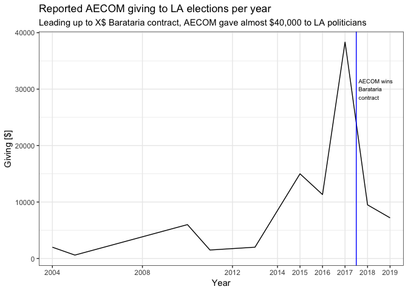

Campaign-finance-analysis
================
Vikas Maturi

# Libraies

``` r
#load libraries
library(tidyverse)
```

    ## ── Attaching packages ───────────────────────────────────────────────────────────────────────────── tidyverse 1.2.1 ──

    ## ✔ ggplot2 3.1.1       ✔ purrr   0.3.2  
    ## ✔ tibble  2.1.1       ✔ dplyr   0.8.0.1
    ## ✔ tidyr   0.8.3       ✔ stringr 1.4.0  
    ## ✔ readr   1.3.1       ✔ forcats 0.4.0

    ## ── Conflicts ──────────────────────────────────────────────────────────────────────────────── tidyverse_conflicts() ──
    ## ✖ dplyr::filter() masks stats::filter()
    ## ✖ dplyr::lag()    masks stats::lag()

``` r
library(lubridate)
```

    ## 
    ## Attaching package: 'lubridate'

    ## The following object is masked from 'package:base':
    ## 
    ##     date

CHANGE THIS TO THE LOCATION OF THE SAVED .RDS FILE ON YOUR COMPUTER\!

``` r
#save the file name where the .Rds data is stored - 
LA_contributions_file <- "~/Autumn-2019/COMM177b/LA-contributions.Rds"

lobbying_file <- "~/Autumn-2019/COMM177b/lobbying_data.Rds"

corrected_AECOM_file <- "~/Autumn-2019/COMM177b/AECOM_contributions_clean.csv"
```

\#ONE TIME ONLY; READ IN FILES AND SAVE COMBINED DATA TO RDS

``` r
#save data file names

file_LA_contributions_101012_020913 <- "~/Autumn-2019/COMM177b/LA_contributions_101012_020913.csv"
file_LA_contributions_021013_060913 <- "~/Autumn-2019/COMM177b/LA_contributions_021013_060913.csv"
file_LA_contributions_061013_100913 <- "~/Autumn-2019/COMM177b/LA_contributions_061013_100913.csv"
file_LA_contributions_101013_020914 <- "~/Autumn-2019/COMM177b/LA_contributions_101013_020914.csv"
file_LA_contributions_021014_060914 <- "~/Autumn-2019/COMM177b/LA_contributions_021014_060914.csv"
file_LA_contributions_061014_100914 <- "~/Autumn-2019/COMM177b/LA_contributions_061014_100914.csv"
file_LA_contributions_101014_020915 <- "~/Autumn-2019/COMM177b/LA_contributions_101014_020915.csv"
file_LA_contributions_021015_060915 <- "~/Autumn-2019/COMM177b/LA_contributions_021015_060915.csv"
file_LA_contributions_061015_100915 <- "~/Autumn-2019/COMM177b/LA_contributions_061018_100918.csv"
file_LA_contributions_101015_020916 <- "~/Autumn-2019/COMM177b/LA_contributions_101015_020916.csv"
file_LA_contributions_021016_060916 <- "~/Autumn-2019/COMM177b/LA_contributions_021016_060916.csv"
file_LA_contributions_061016_100916 <- "~/Autumn-2019/COMM177b/LA_contributions_061016_100916.csv"
file_LA_contributions_101016_020917 <- "~/Autumn-2019/COMM177b/LA_contributions_101016_020917.csv"
file_LA_contributions_021017_060917 <- "~/Autumn-2019/COMM177b/LA_contributions_021017_060917.csv"
file_LA_contributions_061017_100917 <- "~/Autumn-2019/COMM177b/LA_contributions_061017_100917.csv"

file_LA_contributions_101017_020918 <- "~/Autumn-2019/COMM177b/LA_contributions_101017_020918.csv"
file_LA_contributions_021018_060918 <- "~/Autumn-2019/COMM177b/LA_contributions_021018_060918.csv"
file_LA_contributions_061018_100918 <- "~/Autumn-2019/COMM177b/LA_contributions_061018_100918.csv"
file_LA_contributions_101018_020919 <- "~/Autumn-2019/COMM177b/LA_contributions_101018_020919.csv"
file_LA_contributions_021019_060919 <- "~/Autumn-2019/COMM177b/LA_contributions_021019_060919.csv"
file_LA_contributions_061019_101019 <- "~/Autumn-2019/COMM177b/LA_contributions_061019-101019.csv"

#save path to save file 
file_save_combined_path <- "~/Autumn-2019/COMM177b/LA-contributions.Rds"
```

``` r
LA_contributions_101012_020913 <- read_csv(file_LA_contributions_101012_020913)
LA_contributions_021013_060913 <- read_csv(file_LA_contributions_021013_060913)
LA_contributions_061013_100913 <- read_csv(file_LA_contributions_061013_100913)
LA_contributions_101013_020914 <- read_csv(file_LA_contributions_101013_020914)
LA_contributions_021014_060914 <- read_csv(file_LA_contributions_021014_060914)
LA_contributions_061014_100914 <- read_csv(file_LA_contributions_061014_100914) 
LA_contributions_101014_020915 <- read_csv(file_LA_contributions_101014_020915) 
LA_contributions_021015_060915 <- read_csv(file_LA_contributions_021015_060915) 
LA_contributions_061015_100915 <- read_csv(file_LA_contributions_061015_100915) 
LA_contributions_101015_020916 <- read_csv(file_LA_contributions_101015_020916) 
LA_contributions_021016_060916 <- read_csv(file_LA_contributions_021016_060916) 
LA_contributions_061016_100916 <- read_csv(file_LA_contributions_061016_100916) 
LA_contributions_101016_020917 <- read_csv(file_LA_contributions_101016_020917) 
LA_contributions_021017_060917 <- read_csv(file_LA_contributions_021017_060917) 
LA_contributions_061017_100917 <- read_csv(file_LA_contributions_061017_100917)

#read files into tibbles (data frames)
LA_contributions_101017_020918 <- read_csv(file_LA_contributions_101017_020918)
LA_contributions_021018_060918 <- read_csv(file_LA_contributions_021018_060918)
LA_contributions_061018_100918 <- read_csv(file_LA_contributions_061018_100918)
LA_contributions_101018_020919 <- read_csv(file_LA_contributions_101018_020919)
LA_contributions_021019_060919 <- read_csv(file_LA_contributions_021019_060919)
LA_contributions_061019_101019 <- read_csv(file_LA_contributions_061019_101019)
```

``` r
#Join data frames into single tibble (dataframe)
LA_contributions <-
  LA_contributions_061019_101019 %>% 
  bind_rows(LA_contributions_021019_060919) %>% 
  bind_rows(LA_contributions_101018_020919) %>% 
  bind_rows(LA_contributions_061018_100918) %>% 
  bind_rows(LA_contributions_021018_060918) %>% 
  bind_rows(LA_contributions_101017_020918) %>% 
  bind_rows(LA_contributions_061017_100917) %>% 
  bind_rows(LA_contributions_021017_060917) %>% 
  bind_rows(LA_contributions_101016_020917) %>% 
  bind_rows(LA_contributions_061016_100916) %>% 
  bind_rows(LA_contributions_021016_060916) %>% 
  bind_rows(LA_contributions_101015_020916) %>% 
  bind_rows(LA_contributions_061015_100915) %>% 
  bind_rows(LA_contributions_021015_060915) %>% 
  bind_rows(LA_contributions_101014_020915) %>% 
  bind_rows(LA_contributions_061014_100914) %>% 
  bind_rows(LA_contributions_021014_060914) %>% 
  bind_rows(LA_contributions_101013_020914) %>% 
  bind_rows(LA_contributions_061013_100913) %>% 
  bind_rows(LA_contributions_021013_060913) %>% 
  bind_rows(LA_contributions_101012_020913) 
```

``` r
#Write combined data file out output .Rds file
#write_rds(LA_contributions, LA_contributions_file)
```

``` r
lobbying_csv_file <- "~/Autumn-2019/COMM177b/CurrentCompanies.csv"

lobbying_csv <- read_csv(lobbying_csv_file)

write_rds(lobbying_csv, "~/Autumn-2019/COMM177b/lobbying_data.Rds")
```

# Read in .Rds data file will all campaign finance data and AECOM data

``` r
LA_contributions <- 
  read_rds(LA_contributions_file) %>% 
  mutate(ContributionAmt = str_replace(ContributionAmt, "\\$", "")) %>%
  mutate(ContributionAmt = str_replace(ContributionAmt, ",", "")) %>% 
  mutate(ContributionAmt = as.numeric(ContributionAmt))
```

    ## Warning: NAs introduced by coercion

``` r
lobbying <- 
  read_rds(lobbying_file) 

AECOM <- 
  read_csv(corrected_AECOM_file) %>% 
  mutate(ContributionAmt = str_replace(ContributionAmt, "\\$", "")) %>% 
  mutate(ContributionAmt = str_replace(ContributionAmt, ",", "")) %>% 
  mutate(ContributionAmt = as.numeric(ContributionAmt)) %>% 
  mutate(ContributionDate = mdy(ContributionDate))
```

    ## Parsed with column specification:
    ## cols(
    ##   FilerLastName = col_character(),
    ##   FilerFirstName = col_character(),
    ##   ReportCode = col_character(),
    ##   ReportType = col_character(),
    ##   ReportNumber = col_character(),
    ##   ContributorName = col_character(),
    ##   ContributorAddr1 = col_character(),
    ##   ContributorAddr2 = col_character(),
    ##   ContributorCity = col_character(),
    ##   ContributorState = col_character(),
    ##   ContributorZip = col_character(),
    ##   ContributionType = col_character(),
    ##   ContributionDescription = col_character(),
    ##   ContributionDate = col_character(),
    ##   ContributionAmt = col_character()
    ## )

# Understand Report Types (to do)

``` r
LA_contributions %>% select(ReportType) %>% group_by(ReportType) %>% count() %>% arrange(desc(n)) %>% head(10)
```

    ## # A tibble: 10 x 2
    ## # Groups:   ReportType [10]
    ##    ReportType      n
    ##    <chr>       <int>
    ##  1 ANN        511722
    ##  2 MON        475700
    ##  3 30P        149238
    ##  4 10G         44427
    ##  5 10P         39193
    ##  6 180P        38311
    ##  7 MO          33818
    ##  8 40G         32497
    ##  9 SUP         32381
    ## 10 90P         29264

Some notes: I can’t figure out what ReportType (no idea) and ReportCode
(starting with F1 is an individual and F2 is a PAC).

\#TEMPORARILY manually inputting suspicion vendors

\#trying to develop search function for data - not successful

# Data wrangling: Searching contributor database for contractors

## Filter contributor database by keywords

``` r
contractors_filtered <-
  LA_contributions %>% 
  filter(str_detect(ContributorName, "STANTEC|STANTON CONSTRUCTABILITY|AECOM|GEC INC|GHD INC|LOUISIANA DIVERSION COMPANY|LAFITTE AREA|MOTT MACDONALD|NOLA PAC|NOLA ENGINEERING|WEEKS MARINE|SOIL EROSION SERVICES|PROFESSIONAL CONSTRUCTION SERVICES|SIMON AND DELANEY RESOURCE|COASTAL DREDGING COMPANY|SOIL EROSION|GRILLOT CONSTRUCTION|SEALEVEL CONSTRUCTION|HYDROTERRA TECHNOLOGIES|WILCO MARSH BUGGIES|MITCH'S LANDSCAPING|MITCHS LANDSCAPING|LUHR BRO|BAIRD & ASSOCIATES|JUSTIN REEVES|JUSTIN J REEVES|BERTUCCI CONTRACTING|C&C TECHNOLOGIES|APOLLO ENVIRONMENTAL STRATEGIES|TETRA TECH|HDR ENGINEERING|ROYAL ENGINEERING|ECOLOGICAL RESTORATION SERVICES|GREAT LAKES DREDGE|MAGNOLIA DREDGE|EARTHBALANCE|THE NATURE CONSERVANCY|CRESCENT CITY CONNECTION|MARITIME SERVICES GROUP|LCPA|GASERY AND ASSOCIATES|KEEP LOUISIANA BEAUTIFUL|EXPLUS|TRAILBLAZER RC & D|LEXLEE'S KIDS|NORTH LOUISIANA ECONOMIC|KREBS LASALLE|LOUISIANA PROPERTY ACQUISITION|COASTAL ESTUARY SERVICES|GREGORY C RIGAMER|APTIM ENVIRONMENTAL|CH2M HILL|PBS&J|ROYAL ENGINEER|COASTAL ENGINEERING CONSULTANTS|VAN NESS FELDMAN|COUHIG PARTNERS|DUCKS UNLIMITED|NATIONAL AUDUBON SOCIETY|COALITION TO RESTORE COASTAL|INSTITUTE FOR FAMILY DEVELOPME|PAN AMERICAN ENGINEERS|DAN E CIVELLO|PLAQUEMINE PARISH|LTCI CONSULTING|DMS-DISASTER PLANNING|DISASTER METRICS|DULIN, WARD & DEWALD|NEWCORP|SCI RESEARCH AND CONSULTING|TRUFUND FINANCIAL SERVICES|LOUISIANA HOUSING CORPORATION|ZEHNDER COMMUNICATIONS|EMERGENT METHOD|DISASTER SERVICES CORP|DUPLANTIS DESIGN GROUP|SHULER CONSULTING|APACHE LA MINERALS|SISUNG SECURITIES|BACKFLOW PREVENTION|EMERGENT METHOD|STEPHEN B ORTEGO|ANTHONY ROUSSELL|DALE W WYBLE|CHARLES K. MONTGOMERY|SPENCER J OWENS|IMPROVED ANALYSIS THROUGH MODELING|COASTAL CONSERVATION")) %>% 
  arrange(desc(ContributorName)) %>% 
  select(ContributorName, everything()) 
```

## Correct contractor names for misspellings, giving under similar but distinct names (e.g., AECOM LLC vs. AECOM)

``` r
contractor_contributors <-
  contractors_filtered %>%
  mutate(ContributorName = if_else(str_detect(ContributorName, "ROYAL ENGINEER"), "ROYAL ENGINEERS & CONSULTANTS", ContributorName)) %>% 
  mutate(ContributorName = if_else(str_detect(ContributorName, "AECOM"), "AECOM", ContributorName)) %>% 
  mutate(ContributorName = if_else(str_detect(ContributorName, "COUHIG"), "COUHIG", ContributorName)) %>% 
  mutate(ContributorName = if_else(str_detect(ContributorName, "MOTT MACDONALD"), "MOTT MACDONALD", ContributorName)) %>% 
  mutate(ContributorName = if_else(str_detect(ContributorName, "DUPLANTIS"), "DUPLANTIS", ContributorName)) %>%
  mutate(ContributorName = if_else(str_detect(ContributorName, "CH2M"), "CH2M", ContributorName)) %>% 
  mutate(ContributorName = if_else(str_detect(ContributorName, "WILCO MARSH"), "WILCO MARSH", ContributorName)) %>% 
  mutate(ContributorName = if_else(str_detect(ContributorName, "BERTUCCI"), "BERTUCCI CONSULTING", ContributorName)) %>% 
  mutate(ContributorName = if_else(str_detect(ContributorName, "PAN AMERICAN"), "PAN AMERICAN ENGINEERS, LLC", ContributorName)) %>% 
  mutate(ContributorName = if_else(str_detect(ContributorName, "SEALEVEL"), "SEALEVEL CONSTRUCTION INC", ContributorName)) %>%
  mutate(ContributorName = if_else(str_detect(ContributorName, "SOIL EROSION SERVICES"), "SOIL EROSION SERVICES, LLC", ContributorName)) %>%
  mutate(ContributorName = if_else(str_detect(ContributorName, "EMERGENT METHOD"), "EMERGENT METHOD LLC", ContributorName)) %>%
  mutate(ContributorName = if_else(str_detect(ContributorName, "MAGNOLIA DREDGE & DOCK"), "MAGNOLIA DREDGE & DOCK, LLC", ContributorName)) %>%
  mutate(ContributorName = if_else(str_detect(ContributorName, "STANTEC CONSULTING SERVICES"), "STANTEC CONSULTING SERVICES, INC", ContributorName)) %>%
  mutate(ContributorName = if_else(str_detect(ContributorName, "ZEHNDER COMMUNICATIONS"), "ZEHNDER COMMUNICATIONS, LLC", ContributorName))
```

## Total giving by each contractor

``` r
total_giving_contractor <-
  contractor_contributors %>% 
  group_by(ContributorName) %>% 
  summarize(total_giving = sum(ContributionAmt, na.rm = TRUE)) %>% 
  arrange(desc(total_giving))

total_giving_contractor %>% head(20) %>% knitr::kable()
```

| ContributorName                            | total\_giving |
| :----------------------------------------- | ------------: |
| CH2M                                       |     167100.00 |
| ROYAL ENGINEERS & CONSULTANTS              |     129500.00 |
| AECOM                                      |      92275.00 |
| DUPLANTIS                                  |      67542.97 |
| PAN AMERICAN ENGINEERS, LLC                |      43300.00 |
| NOLA PAC                                   |      38000.00 |
| MOTT MACDONALD                             |      20850.00 |
| WILCO MARSH                                |      19680.00 |
| COUHIG                                     |      18800.00 |
| STANTEC CONSULTING SERVICES, INC           |      10100.00 |
| EMERGENT METHOD LLC                        |       6800.00 |
| VAN NESS FELDMAN LLP                       |       5000.00 |
| BERTUCCI CONSULTING                        |       3610.00 |
| MAGNOLIA DREDGE & DOCK, LLC                |       3400.00 |
| SOIL EROSION SERVICES, LLC                 |       3300.00 |
| GREAT LAKES DREDGE & DOCK COMPANY LLC      |       2500.00 |
| APTIM ENVIRONMENTAL & INFRASTRUCTURE, INC. |       2400.00 |
| LOUISIANA PROPERTY ACQUISITION CO. LLC     |       2000.00 |
| LUHR BROS INC                              |       2000.00 |
| ZEHNDER COMMUNICATIONS, LLC                |       1455.20 |

``` r
#Write total_giving_contractor to CSV
#write_csv(total_giving_contractor, "~/Autumn-2019/COMM177b/total_contractor_giving.csv")
```

# Data Wrangling: Lobbying

## Filter lobbying data for relevant contractors

``` r
lobbyists_filtered <-
  lobbying %>% 
  filter(str_detect(Rep_Name, "STANTEC|STANTON CONSTRUCTABILITY|AECOM|GEC INC|GHD INC|LOUISIANA DIVERSION COMPANY|LAFITTE AREA|MOTT MACDONALD|NOLA PAC|NOLA ENGINEERING|WEEKS MARINE|SOIL EROSION SERVICES|PROFESSIONAL CONSTRUCTION SERVICES|SIMON AND DELANEY RESOURCE|COASTAL DREDGING COMPANY|SOIL EROSION|GRILLOT CONSTRUCTION|SEALEVEL CONSTRUCTION|HYDROTERRA TECHNOLOGIES|WILCO MARSH BUGGIES|MITCH'S LANDSCAPING|MITCHS LANDSCAPING|LUHR BRO|BAIRD & ASSOCIATES|JUSTIN REEVES|JUSTIN J REEVES|BERTUCCI CONTRACTING|C&C TECHNOLOGIES|APOLLO ENVIRONMENTAL STRATEGIES|TETRA TECH|HDR ENGINEERING|ROYAL ENGINEERING|ECOLOGICAL RESTORATION SERVICES|GREAT LAKES DREDGE|MAGNOLIA DREDGE|EARTHBALANCE|THE NATURE CONSERVANCY|CRESCENT CITY CONNECTION|MARITIME SERVICES GROUP|LCPA|GASERY AND ASSOCIATES|KEEP LOUISIANA BEAUTIFUL|EXPLUS|TRAILBLAZER RC & D|LEXLEE'S KIDS|NORTH LOUISIANA ECONOMIC|KREBS LASALLE|LOUISIANA PROPERTY ACQUISITION|COASTAL ESTUARY SERVICES|GREGORY C RIGAMER|APTIM ENVIRONMENTAL|CH2M HILL|PBS&J|ROYAL ENGINEER|COASTAL ENGINEERING CONSULTANTS|VAN NESS FELDMAN|COUHIG PARTNERS|DUCKS UNLIMITED|NATIONAL AUDUBON SOCIETY|COALITION TO RESTORE COASTAL|INSTITUTE FOR FAMILY DEVELOPME|PAN AMERICAN ENGINEERS|DAN E CIVELLO|PLAQUEMINE PARISH|LTCI CONSULTING|DMS-DISASTER PLANNING|DISASTER METRICS|DULIN, WARD & DEWALD|NEWCORP|SCI RESEARCH AND CONSULTING|TRUFUND FINANCIAL SERVICES|LOUISIANA HOUSING CORPORATION|ZEHNDER COMMUNICATIONS|EMERGENT METHOD|DISASTER SERVICES CORP|DUPLANTIS DESIGN GROUP|SHULER CONSULTING|APACHE LA MINERALS|SISUNG SECURITIES|BACKFLOW PREVENTION|EMERGENT METHOD|STEPHEN B ORTEGO|ANTHONY ROUSSELL|DALE W WYBLE|CHARLES K. MONTGOMERY|SPENCER J OWENS|IMPROVED ANALYSIS THROUGH MODELING|COASTAL CONSERVATION")) %>% 
  arrange(desc(Rep_Name)) %>% 
  select(Rep_Name, everything()) 
```

## Correct contractor names in lobbying dataset for misspellings, giving under similar but distinct names (e.g., AECOM LLC vs. AECOM)

``` r
contractor_lobbyists <-
  lobbyists_filtered %>%
  mutate(Rep_Name = if_else(str_detect(Rep_Name, "ROYAL ENGINEER"), "ROYAL ENGINEERS & CONSULTANTS", Rep_Name)) %>% 
  mutate(Rep_Name = if_else(str_detect(Rep_Name, "AECOM"), "AECOM", Rep_Name)) %>% 
  mutate(Rep_Name = if_else(str_detect(Rep_Name, "COUHIG"), "COUHIG", Rep_Name)) %>% 
  mutate(Rep_Name = if_else(str_detect(Rep_Name, "MOTT MACDONALD"), "MOTT MACDONALD", Rep_Name)) %>% 
  mutate(Rep_Name = if_else(str_detect(Rep_Name, "DUPLANTIS"), "DUPLANTIS", Rep_Name)) %>%
  mutate(Rep_Name = if_else(str_detect(Rep_Name, "CH2M"), "CH2M", Rep_Name)) %>% 
  mutate(Rep_Name = if_else(str_detect(Rep_Name, "WILCO MARSH"), "WILCO MARSH", Rep_Name)) %>% 
  mutate(Rep_Name = if_else(str_detect(Rep_Name, "BERTUCCI"), "BERTUCCI CONSULTING", Rep_Name)) %>% 
  mutate(Rep_Name = if_else(str_detect(Rep_Name, "PAN AMERICAN"), "PAN AMERICAN ENGINEERS, LLC", Rep_Name)) %>% 
  mutate(Rep_Name = if_else(str_detect(Rep_Name, "SEALEVEL"), "SEALEVEL CONSTRUCTION INC", Rep_Name)) %>%
  mutate(Rep_Name = if_else(str_detect(Rep_Name, "SOIL EROSION SERVICES"), "SOIL EROSION SERVICES, LLC", Rep_Name)) %>%
  mutate(Rep_Name = if_else(str_detect(Rep_Name, "EMERGENT METHOD"), "EMERGENT METHOD LLC", Rep_Name)) %>%
  mutate(Rep_Name = if_else(str_detect(Rep_Name, "MAGNOLIA DREDGE & DOCK"), "MAGNOLIA DREDGE & DOCK, LLC", Rep_Name)) %>%
  mutate(Rep_Name = if_else(str_detect(Rep_Name, "STANTEC CONSULTING SERVICES"), "STANTEC CONSULTING SERVICES, INC", Rep_Name)) %>%
  mutate(Rep_Name = if_else(str_detect(Rep_Name, "ZEHNDER COMMUNICATIONS"), "ZEHNDER COMMUNICATIONS, LLC", Rep_Name))
```

## Number of lobbyists per contractor

``` r
lobbyists_per_contractor <-
  contractor_lobbyists %>% 
  count(Rep_Name) %>% 
  arrange(desc(n))

lobbyists_per_contractor
```

    ## # A tibble: 6 x 2
    ##   Rep_Name                                  n
    ##   <chr>                                 <int>
    ## 1 AECOM                                     6
    ## 2 CH2M                                      3
    ## 3 DUPLANTIS                                 3
    ## 4 NORTH LOUISIANA ECONOMIC PARTNERSHIP      3
    ## 5 COUHIG                                    2
    ## 6 GREAT LAKES DREDGE & DOCK CORPORATION     2

This analysis is less interesting; though a few groups have contractors,
none as extensive as
AECOM.

# Analysis: Which candidates are receiving the most money from contractors?

## Which candidates are receiving the most money from ANY contractor?

``` r
candidate_total_received <-
  contractor_contributors %>% 
  group_by(FilerLastName, FilerFirstName) %>% 
  summarize(total_received = sum(ContributionAmt)) %>% 
  arrange(desc(total_received))

write_csv(candidate_total_received, "~/Autumn-2019/COMM177b/candidates_total_received.csv")
```

This analysis reveals two important additional companies to review: CH2M
and ROYAL ENGINEERS & CONSULTANTS. These consulting groupss have given
massive amounts of money to a number of candidates. Further
investigation is
warranted.

## Which candidates are receiving the most money from contractors giving \> 10,000 since 2012?

``` r
contractors_10000plus <-
  total_giving_contractor %>% 
  filter(total_giving > 10000) %>% 
  select(ContributorName) 

candidate_amt_received_bigmoney_contractors <-
  contractor_contributors %>% 
  inner_join(contractors_10000plus, by = "ContributorName") %>% 
  group_by(FilerLastName, FilerFirstName) %>% 
  summarize(total_received = sum(ContributionAmt)) %>% 
  arrange(desc(total_received))

#write_csv(candidate_amt_received_bigmoney_contractors, "~/Autumn-2019/COMM177b/candidates_amt_received_bigmoney_contractors.csv")
```

Most of the top candidates money is coming from the largest
contributors. This is somewhat logical, but indicates that it a small
number of contracting companies that have outsized influence over
lawmaker
decisions.

# Analysis: Which candidataes are receiving the most money from SPILLWAY developers?

``` r
diversion_contractors <- 
  tribble(~ContributorName, "AECOM", "STANTEC CONSULTING SERVICES", "KREBS LASALLE ENVIRONMENTAL, LLC")

candidate_amt_received_spillway_contractors <-
  contractor_contributors %>% 
  inner_join(diversion_contractors, by = "ContributorName") %>% 
  group_by(FilerLastName, FilerFirstName) %>% 
  summarize(total_received = sum(ContributionAmt)) %>% 
  arrange(desc(total_received))

#write_csv(candidate_amt_received_spillway_contractors, "~/Autumn-2019/COMM177b/candidates_amt_received_spillway_contractors.csv")
```

# Analysis: Investigations into SPILLWAY CONTRACTORS giving extremely large amounts

## AECOM giving to each candidate

``` r
AECOM_candidates <-
  AECOM  %>% 
  arrange(FilerLastName) %>% 
  mutate(available_cont = if_else(is.na(ContributionAmt), 0, ContributionAmt)) %>% 
  group_by(FilerLastName, FilerFirstName) %>% 
  summarize(total_reported = sum(available_cont)) %>% 
  arrange(desc(total_reported))

AECOM_candidates %>% head(10) %>% knitr::kable()
```

| FilerLastName                                      | FilerFirstName  | total\_reported |
| :------------------------------------------------- | :-------------- | --------------: |
| Cantrell                                           | LaToya          |           12500 |
| John Bel Edwards for Louisiana Leadership PAC, LLC | NA              |           10000 |
| Glover                                             | Cedric B.       |            7500 |
| Edwards                                            | John Bel        |            5000 |
| Johnston                                           | Paul            |            5000 |
| Cochran                                            | Larry           |            3500 |
| Zahn                                               | Ben             |            3500 |
| Smith, Jr.                                         | Gary L.         |            3025 |
| Lee-Sheng                                          | Cynthia         |            3000 |
| Nungesser                                          | William (Billy) |            3000 |

``` r
write_csv(AECOM_candidates, "~/Autumn-2019/COMM177b/AECOM_candidate_reported_giving.csv")
```

AECOM focused their giving on the Mayor of New Orleans, LaToya Cantrell
(12,500), and the the governor, John Bel Edwards (15,000 between the PAC
and the candidate directly). Further investigation is required into the
role that these two offices play in the solicitation and selection of
contractors for large environmental projects.

Among the other politicians.

## AECOM total giving

``` r
AECOM_total_giving <-
  AECOM %>% 
  summarize(total_AECOM = sum(ContributionAmt, na.rm = TRUE))

AECOM_total_giving %>% knitr::kable()
```

| total\_AECOM |
| -----------: |
|        93450 |

## AECOM giving per year

``` r
AECOM_yearly_giving <-
  AECOM %>% 
  mutate(year = year(ContributionDate)) %>% 
  group_by(year) %>% 
  summarize(yearly_giving = sum(ContributionAmt))

AECOM_yearly_giving_plot <-
  AECOM_yearly_giving %>% 
  ggplot(mapping = aes(x = year, y = yearly_giving)) +
  geom_line() + 
  theme_bw() +
  scale_x_discrete(limits = c(2004, 2008, 2012, 2014, 2015, 2016, 2017, 2018, 2019)) +
  geom_vline(xintercept = 2017.5, color = "blue") +
  annotate("text", x = 2017.6, y = 30000, label = "AECOM wins\nBarataria\ncontract", size = 2.5, hjust = 0) +
  labs(
    y = "Giving [$]",
    x = "Year",
    title = "Reported AECOM giving to LA elections per year",
    subtitle = "Leading up to X$ Barataria contract, AECOM gave almost $40,000 to LA politicians"
  ) 

AECOM_yearly_giving_plot
```

<!-- -->

``` r
ggsave("AECOM_yearly_giving_plot.pdf", width = 7, height = 5, plot = AECOM_yearly_giving_plot)
```

## STANTEC giving to each candidate

``` r
Stantec_candidates <-
  contractor_contributors %>% 
  filter(str_detect(ContributorName, "STANTEC")) %>% 
  group_by(FilerLastName, FilerFirstName) %>% 
  summarize(total_reported = sum(ContributionAmt)) %>% 
  arrange(desc(total_reported))

Stantec_candidates %>% knitr::kable()
```

| FilerLastName  | FilerFirstName | total\_reported |
| :------------- | :------------- | --------------: |
| Move EBR, Inc. | NA             |           10000 |
| Berthelot, Jr. | Riley L.       |             100 |

``` r
#write_csv(AECOM_candidates, "~/Autumn-2019/COMM177b/AECOM_candidate_reported_giving.csv")
```

STANTEC appears to be giving largely to Move EBR PAC. Further
investigation revealed that MovEBR is a major infrastructure tax package
supported by many local engineering, construction, and consulting firms,
given that it was likely to spur increased business.

## STANTEC total giving

``` r
STANTEC_total_giving <-
  contractor_contributors %>% 
  filter(str_detect(ContributorName, "STANTEC")) %>% 
  summarize(total_stantec = sum(ContributionAmt, na.rm = TRUE))
```

# Investigations into non-spillway contractors giving extremely large amounts

``` r
CH2M_candidates <-
  contractor_contributors %>% 
  filter(str_detect(ContributorName, "CH2M")) %>% 
  group_by(FilerLastName, FilerFirstName) %>% 
  summarize(total_reported = sum(ContributionAmt)) %>% 
  arrange(desc(total_reported))

CH2M_candidates %>% knitr::kable()
```

| FilerLastName                                     | FilerFirstName  | total\_reported |
| :------------------------------------------------ | :-------------- | --------------: |
| Weston Broome                                     | Sharon          |           43500 |
| White                                             | Mack (Bodi)     |           39000 |
| Cantrell                                          | LaToya          |           27000 |
| Charbonnet                                        | Desiree         |           17000 |
| Delgado                                           | John M.         |            5000 |
| Holden                                            | Melvin L. (Kip) |            5000 |
| Marcelle                                          | C. Denise       |            4500 |
| Amoroso                                           | A. J. (Buddy)   |            3500 |
| Banks-Daniel                                      | Chauna          |            3500 |
| Wilson                                            | J. Scott        |            3500 |
| LA Manufacturers Polical Actions Committee (LAMP) | NA              |            3200 |
| Boe                                               | Joel M.         |            2000 |
| Collins-Lewis                                     | Donna           |            2000 |
| Angelle                                           | Scott A.        |            1000 |
| Edwards                                           | Ronnie          |            1000 |
| Freiberg                                          | Barbara Reich   |            1000 |
| Heck                                              | Ryan Eugene     |            1000 |
| Welch                                             | Trae            |            1000 |
| Williams                                          | Jason Rogers    |            1000 |
| Brossett                                          | Jared           |             500 |
| Loupe                                             | Chandler        |             500 |
| Smith                                             | John Raymond    |             500 |
| Harrison                                          | Joseph A.       |             400 |
| Lambert                                           | Eddie J.        |             250 |
| St. Germain                                       | Karen           |             250 |

``` r
#write_csv(CH2M_candidates, "~/Autumn-2019/COMM177b/CH2M_candidates.csv")
```

``` r
Royal_candidates <-
  contractor_contributors %>% 
  filter(str_detect(ContributorName, "ROYAL")) %>% 
  group_by(FilerLastName, FilerFirstName) %>% 
  summarize(total_reported = sum(ContributionAmt)) %>% 
  arrange(desc(total_reported))

Royal_candidates %>% knitr::kable()
```

| FilerLastName                                                                  | FilerFirstName | total\_reported |
| :----------------------------------------------------------------------------- | :------------- | --------------: |
| Williams                                                                       | Jason Rogers   |           16000 |
| NOLA PAC                                                                       | NA             |           12500 |
| Landry                                                                         | Jeff           |           10000 |
| Cantrell                                                                       | LaToya         |            8000 |
| Ramsey                                                                         | Nadine         |            6250 |
| Cajun PAC II                                                                   | NA             |            5000 |
| Charbonnet                                                                     | Desiree        |            5000 |
| LA Democrats (formerly Democratic PAC of the Demo. St. Central Comm., DEMOPAC) | NA             |            5000 |
| Weston Broome                                                                  | Sharon         |            4500 |
| Connick                                                                        | Patrick        |            4000 |
| Ditch                                                                          | David          |            4000 |
| Gray                                                                           | James          |            3750 |
| Kaplan                                                                         | Dana           |            3500 |
| Nicosia                                                                        | Perry          |            3000 |
| Pittman                                                                        | Robin          |            3000 |
| Robottom                                                                       | Natalie        |            3000 |
| Bishop PAC                                                                     | NA             |            2500 |
| Chaisson, III                                                                  | Archie         |            2500 |
| Champagne                                                                      | Simone B.      |            2500 |
| Edwards                                                                        | John Bel       |            2500 |
| Richard                                                                        | M. Larry       |            2500 |
| Brossett                                                                       | Jared          |            2000 |
| Coussan                                                                        | Jean-Paul      |            2000 |
| Ervin-Knott                                                                    | Nakisha        |            2000 |
| Gisleson Palmer                                                                | Kristin        |            2000 |
| Bishop                                                                         | Stuart         |            1500 |
| Alario, Jr.                                                                    | John           |            1000 |
| Beaullieu, IV                                                                  | Gerald (Beau)  |            1000 |
| Callais                                                                        | Kerri          |            1000 |
| CameronPac                                                                     | NA             |            1000 |
| Carter Peterson                                                                | Karen          |            1000 |
| Glover                                                                         | Cedric B.      |            1000 |
| Gonsoulin                                                                      | Ricky          |            1000 |
| Long                                                                           | Gerald         |            1000 |
| Perkins                                                                        | Adrian         |            1000 |
| Bourriaque                                                                     | Ryan           |             500 |
| Molero III                                                                     | Louis Frank    |             500 |
| Hidalgo                                                                        | Jeremy John    |             250 |
| Marshall, Jr.                                                                  | Nolan A.       |             250 |
| Willard                                                                        | Benedict (Ben) |             250 |
| Wright                                                                         | Michael P.     |             250 |

``` r
#write_csv(Royal_candidates, "~/Autumn-2019/COMM177b/Royal_candidates.csv")
```

``` r
STANTEC_total_giving <-
  contractor_contributors %>% 
  filter(str_detect(ContributorName, "STANTEC")) %>% 
  summarize(total_stantec = sum(ContributionAmt, na.rm = TRUE))
```

\#Search lobbying database for contract companies

``` r
contractor_lobbyists <-
  lobbying %>% 
  #this filter is copied directly from the campaign contribution search from above - should be continually copied for consistency.
  filter(str_detect(Rep_Name, "STANTEC|STANTON CONSTRUCTABILITY|AECOM|GEC INC|GHD INC|LOUISIANA DIVERSION COMPANY|LAFITTE AREA|MOTT MACDONALD|NOLA PAC|NOLA ENGINEERING|WEEKS MARINE|SOIL EROSION SERVICES|PROFESSIONAL CONSTRUCTION SERVICES|SIMON AND DELANEY RESOURCE|COASTAL DREDGING COMPANY|SOIL EROSION|GRILLOT CONSTRUCTION|SEALEVEL CONSTRUCTION|HYDROTERRA TECHNOLOGIES|WILCO MARSH BUGGIES|MITCH'S LANDSCAPING|MITCHS LANDSCAPING|LUHR BRO|BAIRD & ASSOCIATES|JUSTIN REEVES|JUSTIN J REEVES|BERTUCCI CONTRACTING|C&C TECHNOLOGIES|APOLLO ENVIRONMENTAL STRATEGIES|TETRA TECH|HDR ENGINEERING|ROYAL ENGINEERING|ECOLOGICAL RESTORATION SERVICES|GREAT LAKES DREDGE|MAGNOLIA DREDGE|EARTHBALANCE|THE NATURE CONSERVANCY|CRESCENT CITY CONNECTION|MARITIME SERVICES GROUP|LCPA|GASERY AND ASSOCIATES|KEEP LOUISIANA BEAUTIFUL|EXPLUS|TRAILBLAZER RC & D|LEXLEE'S KIDS|NORTH LOUISIANA ECONOMIC|KREBS LASALLE ENVIRONMENTAL|LOUISIANA PROPERTY ACQUISITION|COASTAL ESTUARY SERVICES|GREGORY C RIGAMER|APTIM ENVIRONMENTAL|CH2M HILL|PBS&J|ROYAL ENGINEER|COASTAL ENGINEERING CONSULTANTS|VAN NESS FELDMAN|COUHIG PARTNERS|DUCKS UNLIMITED|NATIONAL AUDUBON SOCIETY|COALITION TO RESTORE COASTAL|INSTITUTE FOR FAMILY DEVELOPME|PAN AMERICAN ENGINEERS|DAN E CIVELLO|PLAQUEMINE PARISH|LTCI CONSULTING|DMS-DISASTER PLANNING|DISASTER METRICS|DULIN, WARD & DEWALD|NEWCORP|SCI RESEARCH AND CONSULTING|TRUFUND FINANCIAL SERVICES|LOUISIANA HOUSING CORPORATION|ZEHNDER COMMUNICATIONS|EMERGENT METHOD|DISASTER SERVICES CORP|DUPLANTIS DESIGN GROUP|SHULER CONSULTING|APACHE LA MINERALS|SISUNG SECURITIES|BACKFLOW PREVENTION|EMERGENT METHOD|STEPHEN B ORTEGO|ANTHONY ROUSSELL|DALE W WYBLE|CHARLES K. MONTGOMERY|SPENCER J OWENS|IMPROVED ANALYSIS THROUGH MODELING|COASTAL CONSERVATION|")) %>% 
  arrange(desc(Rep_Name)) %>% 
  select(Rep_Name, everything()) 

write_csv(contractor_lobbyists, "~/Autumn-2019/COMM177b/contractor_lobbying.csv")
```
