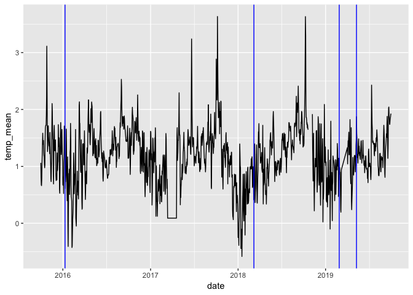
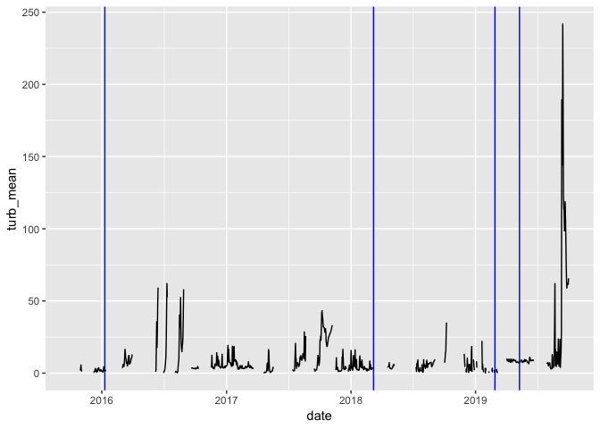
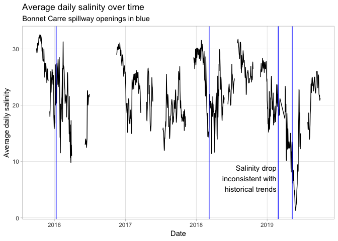
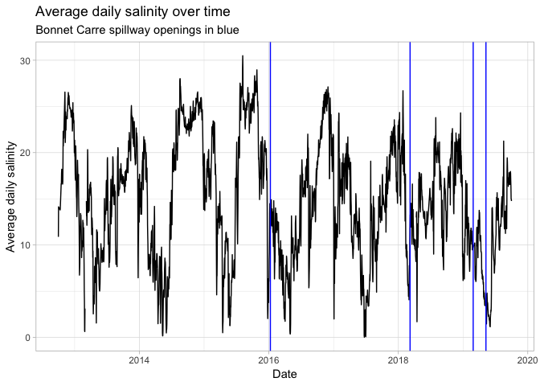
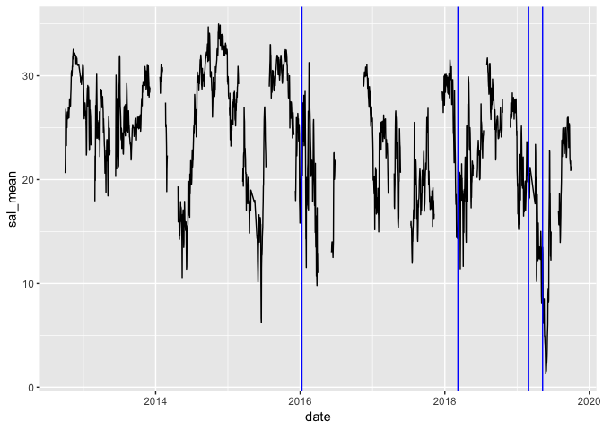

river-quality-data-processing
================
Vikas Maturi

# Libraries and Parameters

``` r
library(tidyverse)
```

    ## ── Attaching packages ─────────────────────────────────────── tidyverse 1.2.1 ──

    ## ✔ ggplot2 3.1.1       ✔ purrr   0.3.2  
    ## ✔ tibble  2.1.1       ✔ dplyr   0.8.0.1
    ## ✔ tidyr   0.8.3       ✔ stringr 1.4.0  
    ## ✔ readr   1.3.1       ✔ forcats 0.4.0

    ## ── Conflicts ────────────────────────────────────────── tidyverse_conflicts() ──
    ## ✖ dplyr::filter() masks stats::filter()
    ## ✖ dplyr::lag()    masks stats::lag()

``` r
#library(rvest)
library(lubridate)
```

    ## 
    ## Attaching package: 'lubridate'

    ## The following object is masked from 'package:base':
    ## 
    ##     date

``` r
#url_data <- "https://nwis.waterdata.usgs.gov/ms/nwis/uv?cb_00010=on&cb_00065=on&cb_00480=on&format=html&site_no=301429089145600&period=&begin_date=2018-11-30&end_date=2019-10-03"

#url_data_test_tsv <- "https://nwis.waterdata.usgs.gov/ms/nwis/uv/?cb_00010=on&cb_00065=on&cb_00300=on&cb_00480=on&cb_63680=on&format=rdb&site_no=301912088583300&period=&begin_date=2018-10-01&end_date=2019-10-01"

#url_data_4years <- "https://nwis.waterdata.usgs.gov/ms/nwis/uv/?cb_00010=on&cb_00065=on&cb_00300=on&cb_00480=on&cb_63680=on&format=rdb&site_no=301912088583300&period=&begin_date=2015-10-01&end_date=2019-10-01"

url_east_ship <- "https://nwis.waterdata.usgs.gov/ms/nwis/uv/?cb_00010=on&cb_00065=on&cb_00300=on&cb_00480=on&cb_63680=on&format=rdb&site_no=301527088521500&period=&begin_date=2015-10-01&end_date=2019-10-01"

url_east_ship_7 <- "https://nwis.waterdata.usgs.gov/ms/nwis/uv/?cb_00010=on&cb_00065=on&cb_00300=on&cb_00480=on&cb_63680=on&format=rdb&site_no=301527088521500&period=&begin_date=2012-10-01&end_date=2019-10-01"

url_biloxi_7 <- "https://nwis.waterdata.usgs.gov/ms/nwis/uv?cb_00010=on&cb_00065=on&cb_00480=on&format=rdb&site_no=302318088512600&period=&begin_date=2012-10-01&end_date=2019-10-01"
```

# Reading in data from various sites

## Reading in East Ship Island Site data (4 years)

``` r
east_ship <- 
  read_tsv(
    url_east_ship, 
    col_names = FALSE,
    col_types =
      cols(
        X1 = col_character(),
        X2 = col_double(),
        X3 = col_datetime(format = ""),
        X4 = col_character(),
        X5 = col_double(),
        X6 = col_character(),
        X7 = col_double(),
        X8 = col_character(),
        X9 = col_double(),
        X10 = col_character(),
        X11 = col_double(),
        X12 = col_character(),
        X13 = col_double(),
        X14 = col_character()
      ),
    comment = "#",
    skip = 50
  ) %>% 
  rename(
    "agency_cd" = X1,
    "site_no" = X2,
    "date_time" = X3,
    "timezone" = X4,
    "gage_height" = X5,
    "gage_app_prov" = X6,
    "temperature" = X7,
    "temp_app_prov" = X8,
    "turbidity" = X9,
    "turb_app_prov" = X10,
    "dissolvedh20" = X11,
    "diss_app_prov" = X12,
    "salinity" = X13,
    "sal_app_prov" = X14,
  ) %>% 
  mutate(temperature = as.double(temperature))
```

    ## Warning: 312 parsing failures.
    ##   row col expected actual                                                                                                                                                                                           file
    ## 47062 X13 a double    Eqp 'https://nwis.waterdata.usgs.gov/ms/nwis/uv/?cb_00010=on&cb_00065=on&cb_00300=on&cb_00480=on&cb_63680=on&format=rdb&site_no=301527088521500&period=&begin_date=2015-10-01&end_date=2019-10-01'
    ## 47077 X13 a double    Eqp 'https://nwis.waterdata.usgs.gov/ms/nwis/uv/?cb_00010=on&cb_00065=on&cb_00300=on&cb_00480=on&cb_63680=on&format=rdb&site_no=301527088521500&period=&begin_date=2015-10-01&end_date=2019-10-01'
    ## 51168 X13 a double    Eqp 'https://nwis.waterdata.usgs.gov/ms/nwis/uv/?cb_00010=on&cb_00065=on&cb_00300=on&cb_00480=on&cb_63680=on&format=rdb&site_no=301527088521500&period=&begin_date=2015-10-01&end_date=2019-10-01'
    ## 51205 X13 a double    Eqp 'https://nwis.waterdata.usgs.gov/ms/nwis/uv/?cb_00010=on&cb_00065=on&cb_00300=on&cb_00480=on&cb_63680=on&format=rdb&site_no=301527088521500&period=&begin_date=2015-10-01&end_date=2019-10-01'
    ## 51238 X13 a double    Eqp 'https://nwis.waterdata.usgs.gov/ms/nwis/uv/?cb_00010=on&cb_00065=on&cb_00300=on&cb_00480=on&cb_63680=on&format=rdb&site_no=301527088521500&period=&begin_date=2015-10-01&end_date=2019-10-01'
    ## ..... ... ........ ...... ..............................................................................................................................................................................................
    ## See problems(...) for more details.

## Reading in East Ship Island site data (7 years)

``` r
east_ship_7 <- 
  read_tsv(
    url_east_ship_7, 
    col_names = FALSE,
    col_types =
      cols(
        X1 = col_character(),
        X2 = col_double(),
        X3 = col_datetime(format = ""),
        X4 = col_character(),
        X5 = col_double(),
        X6 = col_character(),
        X7 = col_double(),
        X8 = col_character(),
        X9 = col_double(),
        X10 = col_character(),
        X11 = col_double(),
        X12 = col_character(),
        X13 = col_double(),
        X14 = col_character()
      ),
    comment = "#",
    skip = 50
  ) %>% 
  rename(
    "agency_cd" = X1,
    "site_no" = X2,
    "date_time" = X3,
    "timezone" = X4,
    "gage_height" = X5,
    "gage_app_prov" = X6,
    "temperature" = X7,
    "temp_app_prov" = X8,
    "turbidity" = X9,
    "turb_app_prov" = X10,
    "dissolvedh20" = X11,
    "diss_app_prov" = X12,
    "salinity" = X13,
    "sal_app_prov" = X14,
  ) %>% 
  mutate(temperature = as.double(temperature))
```

    ## Warning: 312 parsing failures.
    ##    row col expected actual                                                                                                                                                                                           file
    ## 144379 X13 a double    Eqp 'https://nwis.waterdata.usgs.gov/ms/nwis/uv/?cb_00010=on&cb_00065=on&cb_00300=on&cb_00480=on&cb_63680=on&format=rdb&site_no=301527088521500&period=&begin_date=2012-10-01&end_date=2019-10-01'
    ## 144394 X13 a double    Eqp 'https://nwis.waterdata.usgs.gov/ms/nwis/uv/?cb_00010=on&cb_00065=on&cb_00300=on&cb_00480=on&cb_63680=on&format=rdb&site_no=301527088521500&period=&begin_date=2012-10-01&end_date=2019-10-01'
    ## 148485 X13 a double    Eqp 'https://nwis.waterdata.usgs.gov/ms/nwis/uv/?cb_00010=on&cb_00065=on&cb_00300=on&cb_00480=on&cb_63680=on&format=rdb&site_no=301527088521500&period=&begin_date=2012-10-01&end_date=2019-10-01'
    ## 148522 X13 a double    Eqp 'https://nwis.waterdata.usgs.gov/ms/nwis/uv/?cb_00010=on&cb_00065=on&cb_00300=on&cb_00480=on&cb_63680=on&format=rdb&site_no=301527088521500&period=&begin_date=2012-10-01&end_date=2019-10-01'
    ## 148555 X13 a double    Eqp 'https://nwis.waterdata.usgs.gov/ms/nwis/uv/?cb_00010=on&cb_00065=on&cb_00300=on&cb_00480=on&cb_63680=on&format=rdb&site_no=301527088521500&period=&begin_date=2012-10-01&end_date=2019-10-01'
    ## ...... ... ........ ...... ..............................................................................................................................................................................................
    ## See problems(...) for more details.

## Reading in Biloxi site data (7 years)

``` r
biloxi_7 <- 
  read_tsv(
    url_biloxi_7, 
    col_names = FALSE,
    col_types =
      cols(
        X1 = col_character(),
        X2 = col_double(),
        X3 = col_datetime(format = ""),
        X4 = col_character(),
        X5 = col_double(),
        X6 = col_character(),
        X7 = col_double(),
        X8 = col_character(),
        X9 = col_double(),
        X10 = col_character()
      ),
    comment = "#",
    skip = 50
  ) %>% 
  rename(
    "agency_cd" = X1,
    "site_no" = X2,
    "date_time" = X3,
    "timezone" = X4,
    "temperature" = X5,
    "temp_app_prov" = X6,
    "gage_height" = X7,
    "gage_app_prov" = X8,
    "salinity" = X9,
    "sal_app_prov" = X10,
  ) %>% 
  mutate(temperature = as.double(temperature))
```

    ## Warning: 35 parsing failures.
    ##    row col expected actual                                                                                                                                                                  file
    ## 148385  X9 a double    Eqp 'https://nwis.waterdata.usgs.gov/ms/nwis/uv?cb_00010=on&cb_00065=on&cb_00480=on&format=rdb&site_no=302318088512600&period=&begin_date=2012-10-01&end_date=2019-10-01'
    ## 148386  X9 a double    Eqp 'https://nwis.waterdata.usgs.gov/ms/nwis/uv?cb_00010=on&cb_00065=on&cb_00480=on&format=rdb&site_no=302318088512600&period=&begin_date=2012-10-01&end_date=2019-10-01'
    ## 148639  X9 a double    Eqp 'https://nwis.waterdata.usgs.gov/ms/nwis/uv?cb_00010=on&cb_00065=on&cb_00480=on&format=rdb&site_no=302318088512600&period=&begin_date=2012-10-01&end_date=2019-10-01'
    ## 148649  X9 a double    Eqp 'https://nwis.waterdata.usgs.gov/ms/nwis/uv?cb_00010=on&cb_00065=on&cb_00480=on&format=rdb&site_no=302318088512600&period=&begin_date=2012-10-01&end_date=2019-10-01'
    ## 148682  X9 a double    Eqp 'https://nwis.waterdata.usgs.gov/ms/nwis/uv?cb_00010=on&cb_00065=on&cb_00480=on&format=rdb&site_no=302318088512600&period=&begin_date=2012-10-01&end_date=2019-10-01'
    ## ...... ... ........ ...... .....................................................................................................................................................................
    ## See problems(...) for more details.

## Reading in TEST data

# Exploratory Analysis

## Additional graph filtering

``` r
#calculating the average daily salinity, temperature, turbidity - east ship island (4 years)
daily_averages_east_ship <-
  east_ship %>% 
  mutate(date = date(date_time)) %>% 
  group_by(date) %>% 
  summarize(
    sal_mean = mean(salinity, na.rm = TRUE),
    temp_mean = mean(temperature, na.rm = TRUE),
    turb_mean = mean(turbidity, na.rm = TRUE),
    H20_mean = mean(dissolvedh20, na.rm = TRUE)
    ) %>% 
  arrange(date)

#calculating the average daily salinity, temperature, turbidity - east ship island (7 years)
daily_averages_east_ship_7 <-
  east_ship_7 %>% 
  mutate(date = date(date_time)) %>% 
  group_by(date) %>% 
  summarize(
    sal_mean = mean(salinity, na.rm = TRUE),
    temp_mean = mean(temperature, na.rm = TRUE),
    turb_mean = mean(turbidity, na.rm = TRUE),
    H20_mean = mean(dissolvedh20, na.rm = TRUE)
    ) %>% 
  arrange(date)


#calculating the average daily salinity, temperature, turbidity - biloxi (7 years)
daily_averages_biloxi_7 <-
  biloxi_7 %>% 
  mutate(date = date(date_time)) %>% 
  group_by(date) %>% 
  summarize(
    sal_mean = mean(salinity, na.rm = TRUE),
    temp_mean = mean(temperature, na.rm = TRUE),
    gage_mean = mean(gage_height, na.rm = TRUE)
    ) %>% 
  arrange(date)
```

\#Daily Average Temperature in East Ship Island (4 years)

``` r
daily_averages_east_ship %>% 
  ggplot(mapping = aes(x = date, y = temp_mean)) +
  geom_line() +
  #Markers of the fur main spillway openings
  geom_vline(aes(xintercept = date("2016-01-10")), color = "blue") + 
  geom_vline(aes(xintercept = date("2018-03-08")), color = "blue") + 
  geom_vline(aes(xintercept = date("2019-02-27")), color = "blue") + 
  geom_vline(aes(xintercept = date("2019-05-10")), color = "blue")
```

<!-- -->

\#Daily Average Turbidity in East Ship Island (4 years)

``` r
daily_averages_east_ship %>% 
  ggplot(mapping = aes(x = date, y = turb_mean)) +
  geom_line() +
  #Markers of the fur main spillway openings
  geom_vline(aes(xintercept = date("2016-01-10")), color = "blue") + 
  geom_vline(aes(xintercept = date("2018-03-08")), color = "blue") + 
  geom_vline(aes(xintercept = date("2019-02-27")), color = "blue") + 
  geom_vline(aes(xintercept = date("2019-05-10")), color = "blue")
```

    ## Warning: Removed 29 rows containing missing values (geom_path).

<!-- -->

\#Daily Average Salinity in East Ship Island (4 years)

``` r
daily_averages_east_ship %>% 
  ggplot(mapping = aes(x = date, y = sal_mean)) +
  geom_line() +
  theme_light() +
  theme(
    panel.grid.minor = element_blank()
  ) +
  #Markers of the fur main spillway openings
  geom_vline(aes(xintercept = date("2016-01-10")), color = "blue") + 
  geom_vline(aes(xintercept = date("2018-03-08")), color = "blue") + 
  geom_vline(aes(xintercept = date("2019-02-27")), color = "blue") + 
  geom_vline(aes(xintercept = date("2019-05-10")), color = "blue") +
  #text annotations
  annotate("text", x = date("2019-03-01"), y = 7, label = "Salinity drop \ninconsistent with \nhistorical trends ", hjust = "right", ) +
  labs(
    title = "Average daily salinity over time",
    subtitle = "Bonnet Carre spillway openings in blue",
    x = "Date",
    y = "Average daily salinity"
  ) 
```

<!-- -->

``` r
## ADD SCALES TO THIS GRAPH!! b
```

We see a significant drop in salinity levels in 2019, despite consistent
levels in years prior (even during spillway openings).

\#Daily Average Salinity in Biloxi (7 years)

``` r
daily_averages_biloxi_7 %>% 
  ggplot(mapping = aes(x = date, y = sal_mean)) +
  geom_line() +
  theme_light() +
  theme(
  ) +
  #Markers of the fur main spillway openings
  geom_vline(aes(xintercept = date("2016-01-10")), color = "blue") + 
  geom_vline(aes(xintercept = date("2018-03-08")), color = "blue") + 
  geom_vline(aes(xintercept = date("2019-02-27")), color = "blue") + 
  geom_vline(aes(xintercept = date("2019-05-10")), color = "blue") +
  #text annotations
  labs(
    title = "Average daily salinity over time",
    subtitle = "Bonnet Carre spillway openings in blue",
    x = "Date",
    y = "Average daily salinity"
  ) 
```

<!-- -->

``` r
## ADD SCALES TO THIS GRAPH!! b
```

At the Biloxi site, we see no obvious drop beyond other sites, but we do
see a clear change in the frequency of salinity shifts (up and down
drops) - they appear more frequent and less regular moving past 2016.

\#Daily Average Salinity in East Ship Island (7 years)

``` r
daily_averages_east_ship_7 %>% 
  ggplot(mapping = aes(x = date, y = sal_mean)) +
  geom_line() +
  #Markers of the fur main spillway openings
  geom_vline(aes(xintercept = date("2016-01-10")), color = "blue") + 
  geom_vline(aes(xintercept = date("2018-03-08")), color = "blue") + 
  geom_vline(aes(xintercept = date("2019-02-27")), color = "blue") + 
  geom_vline(aes(xintercept = date("2019-05-10")), color = "blue") 
```

<!-- -->

Looking at more historical trends, we notice no salinity drop has been
as significant as the 2019 drop after 2 spillway openings.
