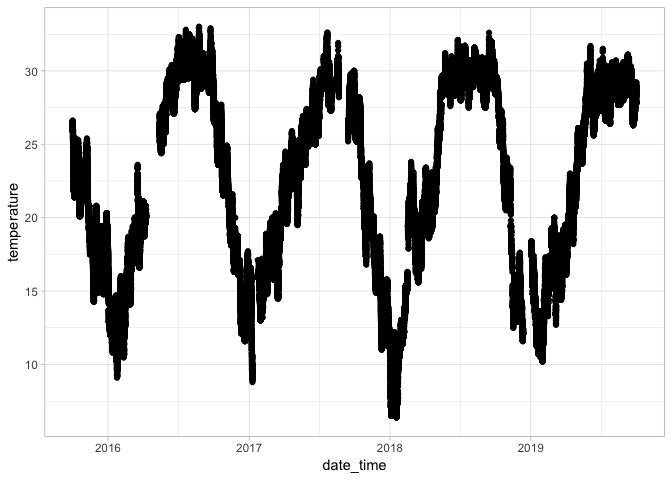

river-quality-data-processing
================
Vikas Maturi

# Libraries and Parameters

``` r
library(tidyverse)
```

    ## ── Attaching packages ────────────────────────────────────────────────────────────────────────────────────── tidyverse 1.2.1 ──

    ## ✔ ggplot2 3.1.1       ✔ purrr   0.3.2  
    ## ✔ tibble  2.1.1       ✔ dplyr   0.8.0.1
    ## ✔ tidyr   0.8.3       ✔ stringr 1.4.0  
    ## ✔ readr   1.3.1       ✔ forcats 0.4.0

    ## ── Conflicts ───────────────────────────────────────────────────────────────────────────────────────── tidyverse_conflicts() ──
    ## ✖ dplyr::filter() masks stats::filter()
    ## ✖ dplyr::lag()    masks stats::lag()

``` r
library(rvest)
```

    ## Loading required package: xml2

    ## 
    ## Attaching package: 'rvest'

    ## The following object is masked from 'package:purrr':
    ## 
    ##     pluck

    ## The following object is masked from 'package:readr':
    ## 
    ##     guess_encoding

``` r
library(lubridate)
```

    ## 
    ## Attaching package: 'lubridate'

    ## The following object is masked from 'package:base':
    ## 
    ##     date

``` r
#url_data <- "https://nwis.waterdata.usgs.gov/ms/nwis/uv?cb_00010=on&cb_00065=on&cb_00480=on&format=html&site_no=301429089145600&period=&begin_date=2018-11-30&end_date=2019-10-03"

url_data_test_tsv <- "https://nwis.waterdata.usgs.gov/ms/nwis/uv/?cb_00010=on&cb_00065=on&cb_00300=on&cb_00480=on&cb_63680=on&format=rdb&site_no=301912088583300&period=&begin_date=2018-10-01&end_date=2019-10-01"

url_data_4years <- "https://nwis.waterdata.usgs.gov/ms/nwis/uv/?cb_00010=on&cb_00065=on&cb_00300=on&cb_00480=on&cb_63680=on&format=rdb&site_no=301912088583300&period=&begin_date=2015-10-01&end_date=2019-10-01"
```

\#Reading data from online table USGS

``` r
#Do NOT USE
# read_html(url_data) %>% 
#   html_node(css = "body > table.tablesorter.dataListWithSuperscript.tablesorter-jui.ui-widget.ui-widget-content.ui-corner-all.hasStickyHeaders.hasFilters > tbody") %>% 
#   html_table()
```

## Reading in primary (4year timespan) data

``` r
## NOTE: THIS IS NOT CORRECTLY READING IN SALINITY DATA ##
usgs_data_4 <- 
  read_tsv(
    url_data_4years, 
    col_names = FALSE,
    col_types =
      cols(
        agency_cd = col_character(),
        site_no = col_double(),
        date_time = col_datetime(format = ""),
        timezone = col_character(),
        gage_height = col_double(),
        gage_app_prov = col_character(),
        temperature = col_double(),
        temp_app_prov = col_character(),
        salinity = col_double(),
        sal_app_prov = col_character(),
        turbidity = col_double(),
        turb_app_prov = col_character(),
        dissolvedh20 = col_double(),
        diss_app_prov = col_character()
      ),
    comment = "#",
    skip = 50
  ) %>% 
  rename(
    "agency_cd" = X1,
    "site_no" = X2,
    "date_time" = X3,
    "timezone" = X4,
    "gage_height" = X5,
    "gage_app_prov" = X6,
    "temperature" = X7,
    "temp_app_prov" = X8,
    "salinity" = X9,
    "sal_app_prov" = X10,
    "turbidity" = X11,
    "turb_app_prov" = X12,
    "dissolvedh20" = X13,
    "diss_app_prov" = X14
  ) %>% 
  mutate(temperature = as.double(temperature))
```

    ## Warning: The following named parsers don't match the column names:
    ## agency_cd, site_no, date_time, timezone, gage_height, gage_app_prov,
    ## temperature, temp_app_prov, salinity, sal_app_prov, turbidity,
    ## turb_app_prov, dissolvedh20, diss_app_prov

    ## Warning: 75039 parsing failures.
    ##   row col           expected actual                                                                                                                                                                                           file
    ## 61697 X7  a double              Eqp 'https://nwis.waterdata.usgs.gov/ms/nwis/uv/?cb_00010=on&cb_00065=on&cb_00300=on&cb_00480=on&cb_63680=on&format=rdb&site_no=301912088583300&period=&begin_date=2015-10-01&end_date=2019-10-01'
    ## 61699 X13 a double              Eqp 'https://nwis.waterdata.usgs.gov/ms/nwis/uv/?cb_00010=on&cb_00065=on&cb_00300=on&cb_00480=on&cb_63680=on&format=rdb&site_no=301912088583300&period=&begin_date=2015-10-01&end_date=2019-10-01'
    ## 66533 X11 a double              Eqp 'https://nwis.waterdata.usgs.gov/ms/nwis/uv/?cb_00010=on&cb_00065=on&cb_00300=on&cb_00480=on&cb_63680=on&format=rdb&site_no=301912088583300&period=&begin_date=2015-10-01&end_date=2019-10-01'
    ## 70334 X9  1/0/T/F/TRUE/FALSE    29  'https://nwis.waterdata.usgs.gov/ms/nwis/uv/?cb_00010=on&cb_00065=on&cb_00300=on&cb_00480=on&cb_63680=on&format=rdb&site_no=301912088583300&period=&begin_date=2015-10-01&end_date=2019-10-01'
    ## 70334 X10 1/0/T/F/TRUE/FALSE    P   'https://nwis.waterdata.usgs.gov/ms/nwis/uv/?cb_00010=on&cb_00065=on&cb_00300=on&cb_00480=on&cb_63680=on&format=rdb&site_no=301912088583300&period=&begin_date=2015-10-01&end_date=2019-10-01'
    ## ..... ... .................. ...... ..............................................................................................................................................................................................
    ## See problems(...) for more details.

## Reading in TEST data

``` r
#previous approach to storing column names
# names_usgs_data <- 
#   read_tsv(url_data_tsv, col_names = FALSE, n_max = 1, comment ="#") %>% 

#reading in the test data set (1 year), casting column types and renaming columns.
usgs_data_test <- 
  read_tsv(
    url_data_test_tsv, 
    col_names = FALSE,
    col_types =
      cols(
        agency_cd = col_character(),
        site_no = col_double(),
        date_time = col_datetime(format = ""),
        timezone = col_character(),
        gage_height = col_double(),
        gage_app_prov = col_character(),
        temperature = col_double(),
        temp_app_prov = col_character(),
        salinity = col_double(),
        sal_app_prov = col_character(),
        turbidity = col_double(),
        turb_app_prov = col_character(),
        dissolvedh20 = col_double(),
        diss_app_prov = col_character()
      ),
    comment = "#",
    skip = 50
  ) %>% 
  rename(
    "agency_cd" = X1,
    "site_no" = X2,
    "date_time" = X3,
    "timezone" = X4,
    "gage_height" = X5,
    "gage_app_prov" = X6,
    "temperature" = X7,
    "temp_app_prov" = X8,
    "salinity" = X9,
    "sal_app_prov" = X10,
    "turbidity" = X11,
    "turb_app_prov" = X12,
    "dissolvedh20" = X13,
    "diss_app_prov" = X14
  ) %>% 
  mutate(temperature = as.double(temperature))
```

    ## Warning: The following named parsers don't match the column names:
    ## agency_cd, site_no, date_time, timezone, gage_height, gage_app_prov,
    ## temperature, temp_app_prov, salinity, sal_app_prov, turbidity,
    ## turb_app_prov, dissolvedh20, diss_app_prov

    ## Warning: 212 parsing failures.
    ##   row col expected actual                                                                                                                                                                                           file
    ##  5497 X13 a double    *** 'https://nwis.waterdata.usgs.gov/ms/nwis/uv/?cb_00010=on&cb_00065=on&cb_00300=on&cb_00480=on&cb_63680=on&format=rdb&site_no=301912088583300&period=&begin_date=2018-10-01&end_date=2019-10-01'
    ##  5499 X9  a double    Eqp 'https://nwis.waterdata.usgs.gov/ms/nwis/uv/?cb_00010=on&cb_00065=on&cb_00300=on&cb_00480=on&cb_63680=on&format=rdb&site_no=301912088583300&period=&begin_date=2018-10-01&end_date=2019-10-01'
    ##  6752 X13 a double    Eqp 'https://nwis.waterdata.usgs.gov/ms/nwis/uv/?cb_00010=on&cb_00065=on&cb_00300=on&cb_00480=on&cb_63680=on&format=rdb&site_no=301912088583300&period=&begin_date=2018-10-01&end_date=2019-10-01'
    ## 13118 X11 a double    Eqp 'https://nwis.waterdata.usgs.gov/ms/nwis/uv/?cb_00010=on&cb_00065=on&cb_00300=on&cb_00480=on&cb_63680=on&format=rdb&site_no=301912088583300&period=&begin_date=2018-10-01&end_date=2019-10-01'
    ## 13279 X11 a double    Eqp 'https://nwis.waterdata.usgs.gov/ms/nwis/uv/?cb_00010=on&cb_00065=on&cb_00300=on&cb_00480=on&cb_63680=on&format=rdb&site_no=301912088583300&period=&begin_date=2018-10-01&end_date=2019-10-01'
    ## ..... ... ........ ...... ..............................................................................................................................................................................................
    ## See problems(...) for more details.

    ## Warning: NAs introduced by coercion

``` r
# names(usgs_data_test) <- names_usgs_data
```

## Additional graph filtering

``` r
#selecting just the first measurement of each day for simplicity while graphing (as needed)
one_day_measurements <-
  usgs_data_4 %>% 
  mutate(date = date(date_time)) %>% 
  group_by(date) %>% 
  arrange(date_time) %>% 
  slice(1) %>% 
  ungroup()
```

# Exploratory Analysis

``` r
##
# previous plot with all data (too crowded) of temperature change over time. 
usgs_data_4 %>%
  ggplot(mapping = aes(x = date_time, y = temperature)) +
  geom_point() +
  geom_line() +
  theme_light()
```

    ## Warning: Removed 10637 rows containing missing values (geom_point).

<!-- -->

``` r
# plotting temperature with just the first measurement of each day.
# one_day_measurements %>% 
#   ggplot(mapping = aes(x = date_time, y = temperature)) +
#   geom_line()
```

``` r
#plotting the change in SALINITY over time [NOTE: NOT WORKING! SALINITY DATA NOT COMING IN PROPERLY]
usgs_data_4 %>% 
  ggplot(mapping = aes(x = date_time, y = salinity)) +
  geom_line()
```

<!-- -->

``` r
one_day_measurements %>% 
  ggplot(mapping = aes(x = date_time, y = gage_height)) +
  geom_line()
```

    ## Warning: Removed 4 rows containing missing values (geom_path).

<!-- -->

Broadly, there appears to be a fair amount of consistency in temperature
and gage height over the past four years.
